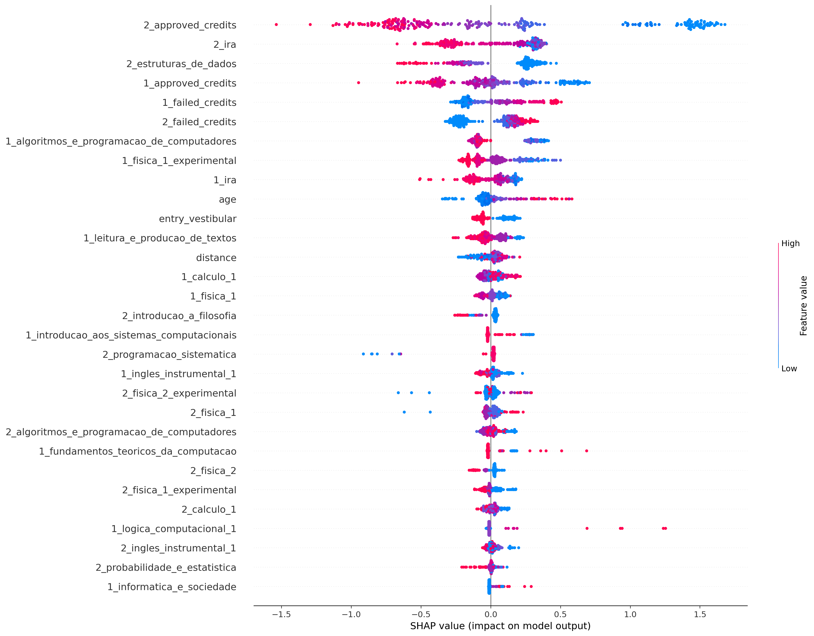
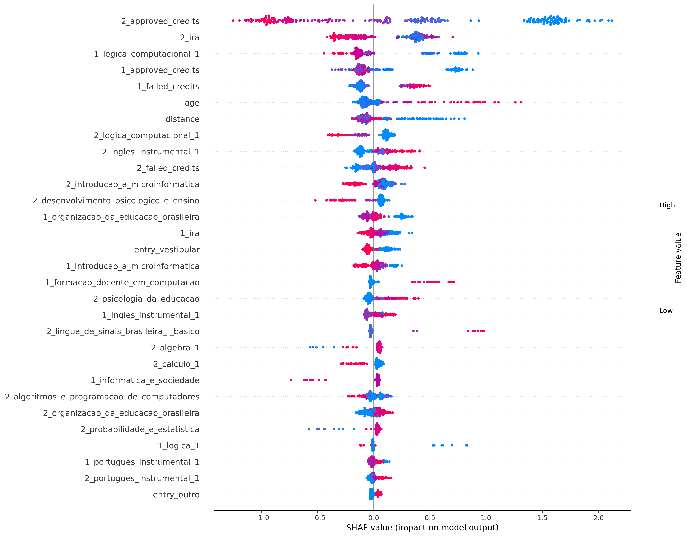
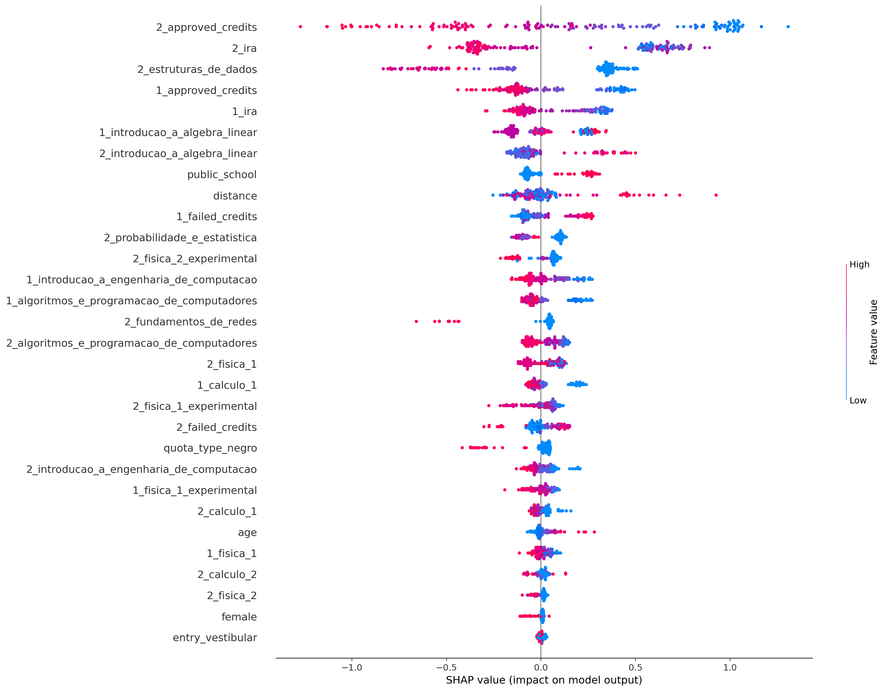
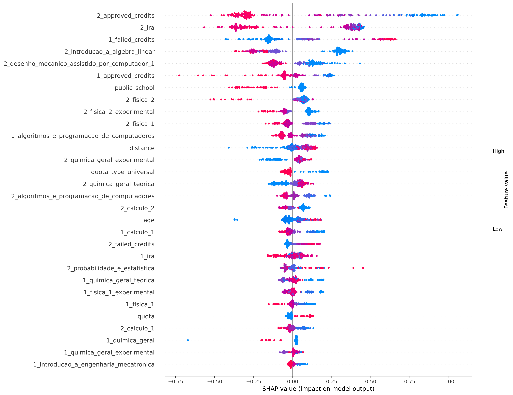
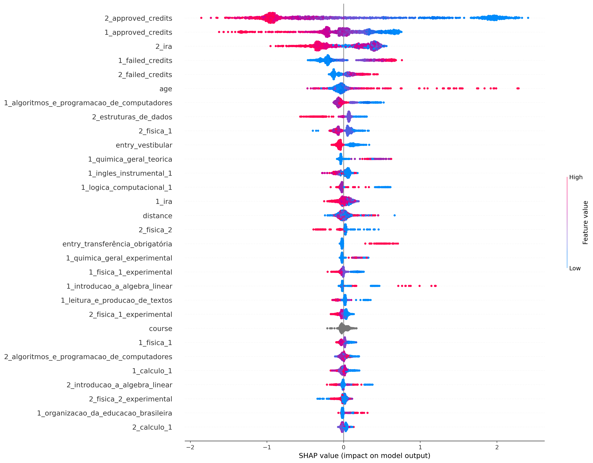

# Resultados

* Timeframe [2004, 2022]
* Todos os atributos

## ciência_da_computação
Treino:
*   Accuracy = 93.70%
*   Precision = 93.68%
*   Recall = 96.62%
*   FScore = 95.39%

Teste:
*   Accuracy = 81.36%
*   Precision = 83.42%
*   Recall = 88.14%
*   FScore = 86.14%

## computação
Treino:
*   Accuracy = 96.17%
*   Precision = 97.47%
*   Recall = 97.47%
*   FScore = 97.47%

Teste:
*   Accuracy = 80.74%
*   Precision = 86.19%
*   Recall = 88.73%
*   FScore = 87.67%

## engenharia_de_computação
Treino:
*   Accuracy = 93.35%
*   Precision = 95.42%
*   Recall = 94.24%
*   FScore = 94.72%

Teste:
*   Accuracy = 76.54%
*   Precision = 78.95%
*   Recall = 86.54%
*   FScore = 83.26%

## engenharia_mecatrônica
Treino:
*   Accuracy = 88.49%
*   Precision = 85.51%
*   Recall = 94.02%
*   FScore = 90.34%

Teste:
*   Accuracy = 78.05%
*   Precision = 73.68%
*   Recall = 90.74%
*   FScore = 82.88%

## all
Treino:
*   Accuracy = 86.40%
*   Precision = 85.33%
*   Recall = 95.44%
*   FScore = 91.02%

Teste:
*   Accuracy = 79.13%
*   Precision = 79.65%
*   Recall = 91.06%
*   FScore = 86.01%

## Frequência:

ciência_da_computação:
* Evadido     591
* Formado     339

computação:
* Evadido     679
* Formado     218

engenharia_de_computação:
* Evadido     347
* Formado     191

engenharia_mecatrônica:
* Evadido     359
* Formado     324

all:
* Evadido     1976
* Formado     1072