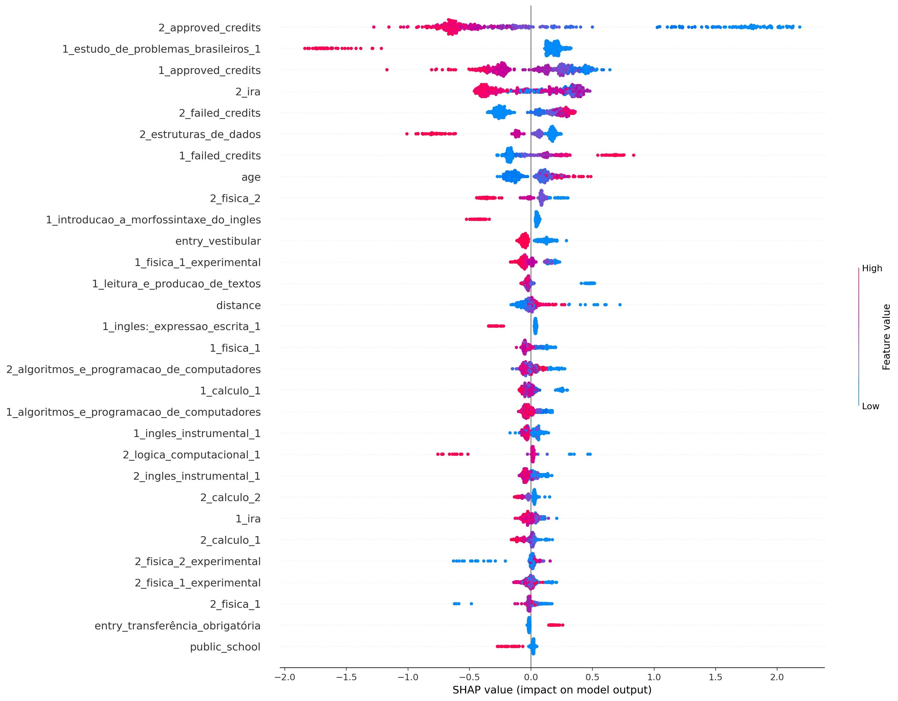
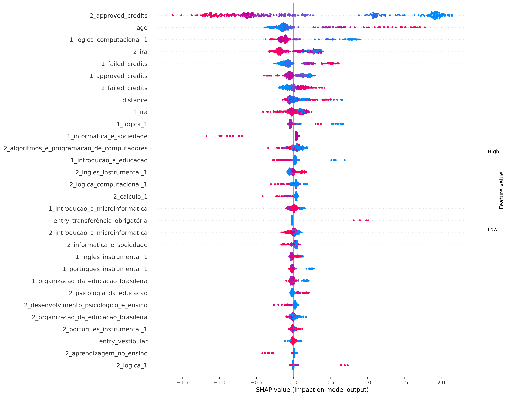
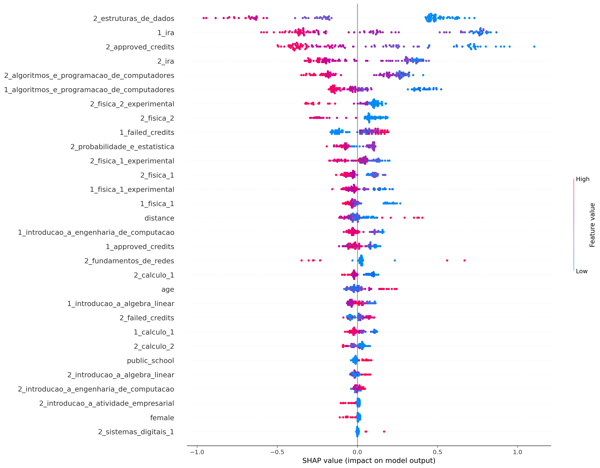
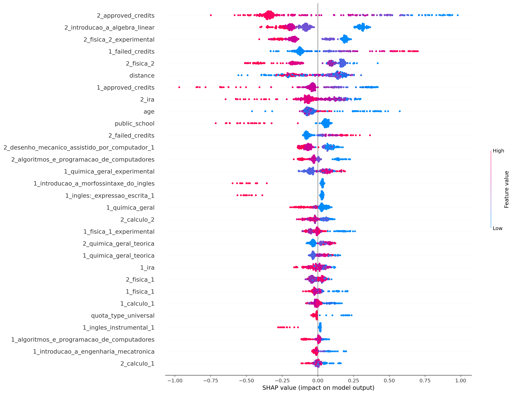
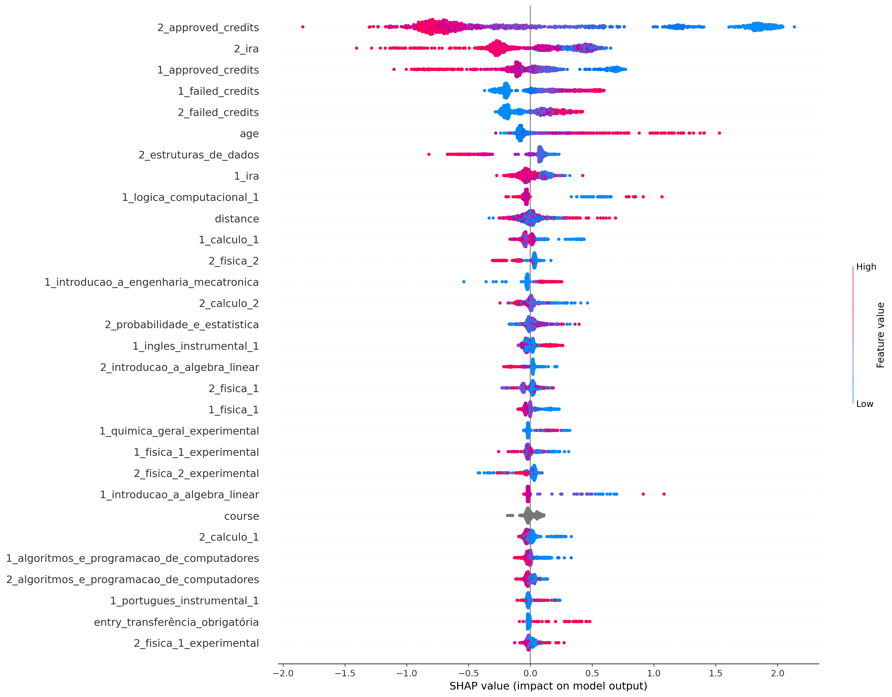

# Resultados:

* Timeframe [1990, 2014]
* Todos os atributos

## ciência_da_computação
Treino:
*   Accuracy = 91.57%
*   Precision = 90.30%
*   Recall = 93.32%
*   FScore = 92.06%

Teste:
*   Accuracy = 79.66%
*   Precision = 77.83%
*   Recall = 83.50%
*   FScore = 81.08%

## computação
Treino:
*   Accuracy = 94.84%
*   Precision = 96.30%
*   Recall = 96.30%
*   FScore = 96.30%

Teste:
*   Accuracy = 77.26%
*   Precision = 84.06%
*   Recall = 83.25%
*   FScore = 83.58%

## engenharia_de_computação
Treino:
*   Accuracy = 94.64%
*   Precision = 94.00%
*   Recall = 96.58%
*   FScore = 95.50%

Teste:
*   Accuracy = 72.32%
*   Precision = 71.05%
*   Recall = 85.71%
*   FScore = 79.03%

## engenharia_mecatrônica
Treino:
*   Accuracy = 90.26%
*   Precision = 84.80%
*   Recall = 93.31%
*   FScore = 89.62%

Teste:
*   Accuracy = 77.70%
*   Precision = 69.92%
*   Recall = 80.87%
*   FScore = 75.99%

## all
Treino:
*   Accuracy = 87.51%
*   Precision = 87.55%
*   Recall = 89.65%
*   FScore = 88.78%

Teste:
*   Accuracy = 78.10%
*   Precision = 79.37%
*   Recall = 80.44%
*   FScore = 80.00%

## Frequência:

ciência_da_computação:
* Evadido     685
* Formado     672

computação:
* Evadido     696
* Formado     300

engenharia_de_computação:
* Evadido     209
* Formado     164

engenharia_mecatrônica:
* Formado     541
* Evadido     384

all:
* Evadido     1974
* Formado     1677