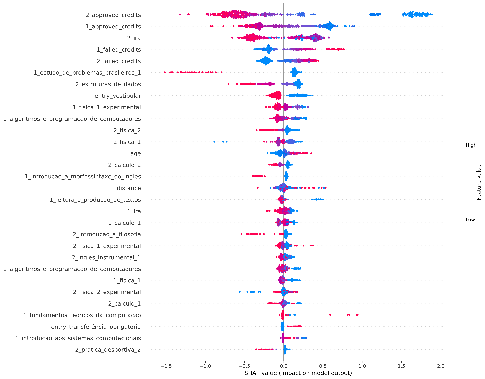
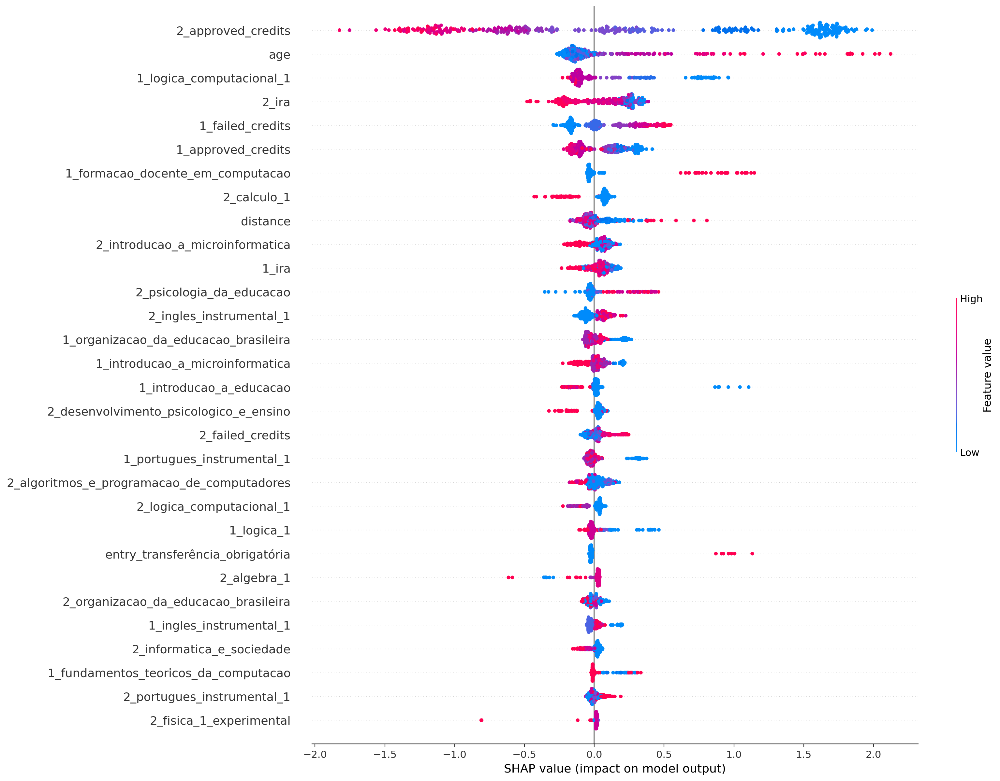
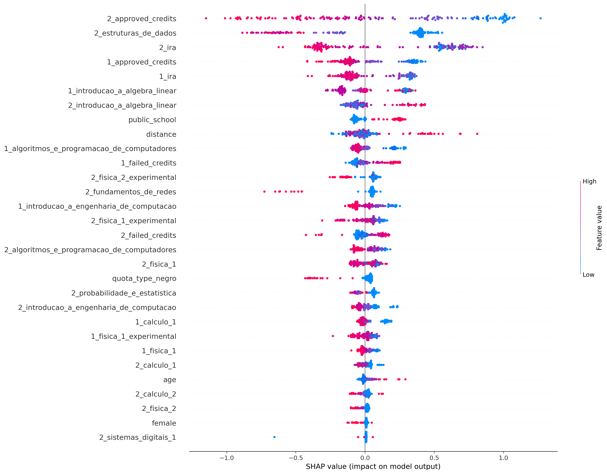
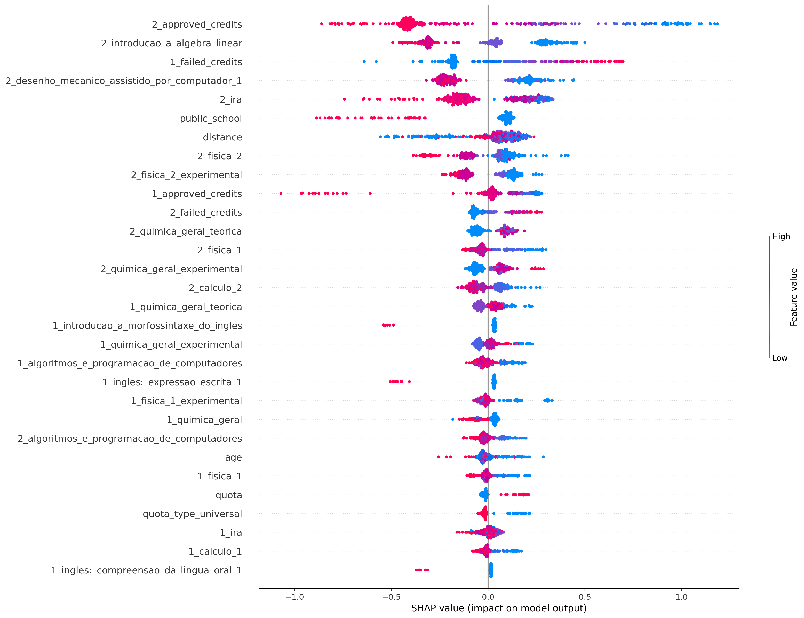
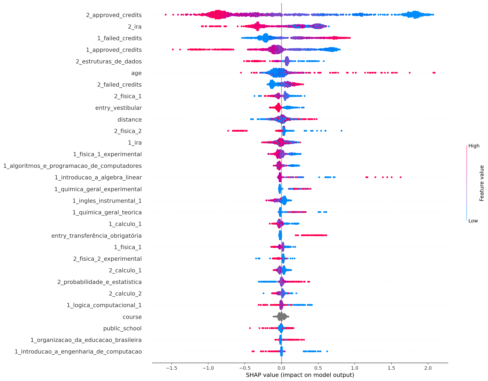

# Resultados

* Timeframe completo
* Todos os atributos

## ciência_da_computação
Treino:
*   Accuracy = 91.74%
*   Precision = 91.60%
*   Recall = 93.48%
*   FScore = 92.70%

Teste:
*   Accuracy = 78.60%
*   Precision = 79.31%
*   Recall = 82.47%
*   FScore = 81.15%

## computação
Treino:
*   Accuracy = 93.98%
*   Precision = 96.18%
*   Recall = 95.54%
*   FScore = 95.80%

Teste:
*   Accuracy = 78.15%
*   Precision = 83.96%
*   Recall = 86.54%
*   FScore = 85.46%

## engenharia_de_computação
Treino:
*   Accuracy = 93.09%
*   Precision = 93.93%
*   Recall = 95.47%
*   FScore = 94.83%

Teste:
*   Accuracy = 74.69%
*   Precision = 76.92%
*   Recall = 86.54%
*   FScore = 82.32%

## engenharia_mecatrônica
Treino:
*   Accuracy = 89.50%
*   Precision = 86.31%
*   Recall = 91.96%
*   FScore = 89.56%

Teste:
*   Accuracy = 73.31%
*   Precision = 70.95%
*   Recall = 72.41%
*   FScore = 71.80%

## all
Treino:
*   Accuracy = 86.90%
*   Precision = 87.31%
*   Recall = 91.01%
*   FScore = 89.46%

Teste:
*   Accuracy = 78.30%
*   Precision = 79.34%
*   Recall = 85.51%
*   FScore = 82.87%

## Frequência:

ciência_da_computação:
* Evadido     834
* Formado     690

computação:
* Evadido     866
* Formado     322

engenharia_de_computação:
* Evadido     347
* Formado     191

engenharia_mecatrônica:
* Formado     554
* Evadido     481

all:
* Evadido     2528
* Formado     1757