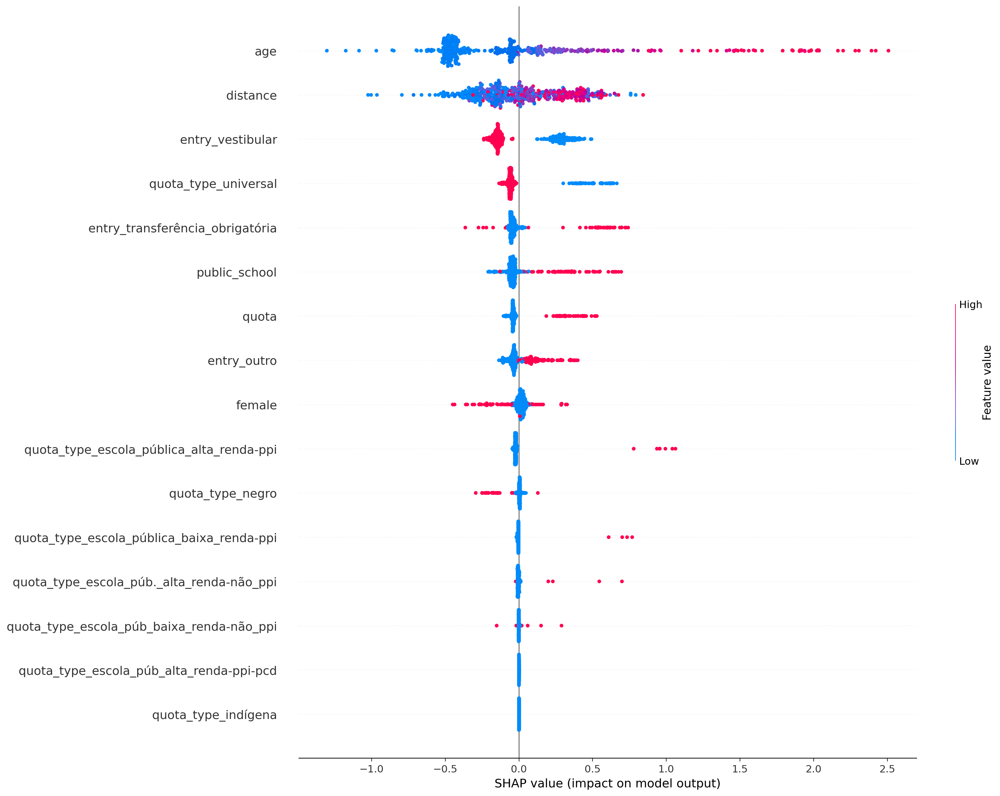
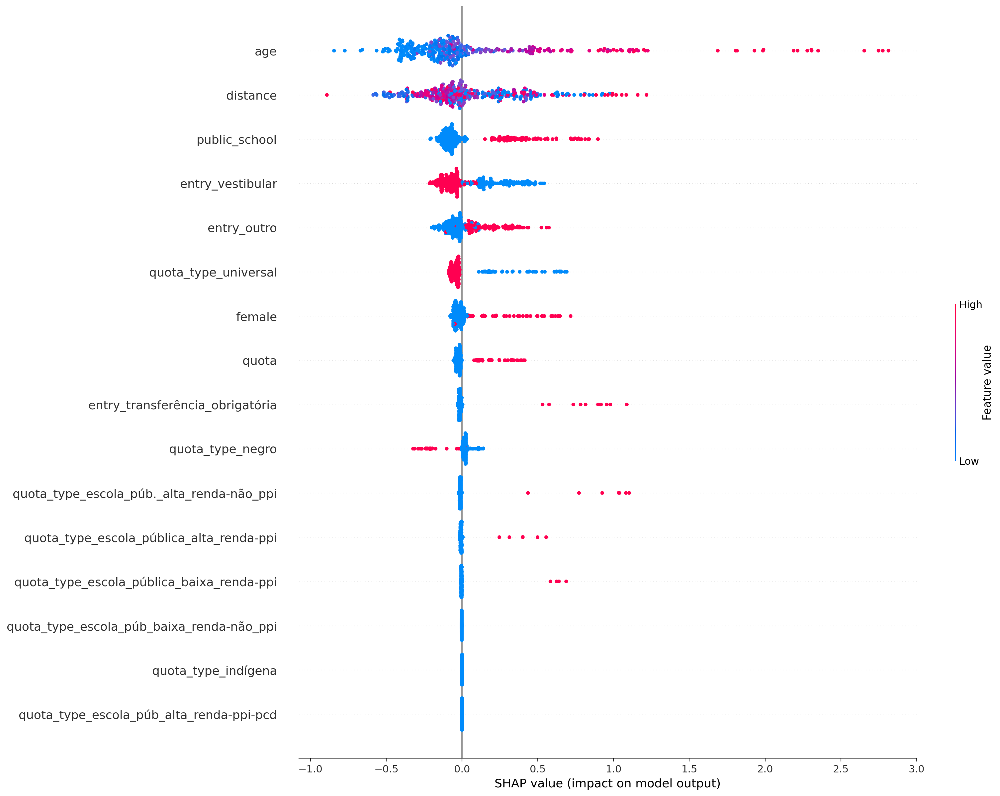
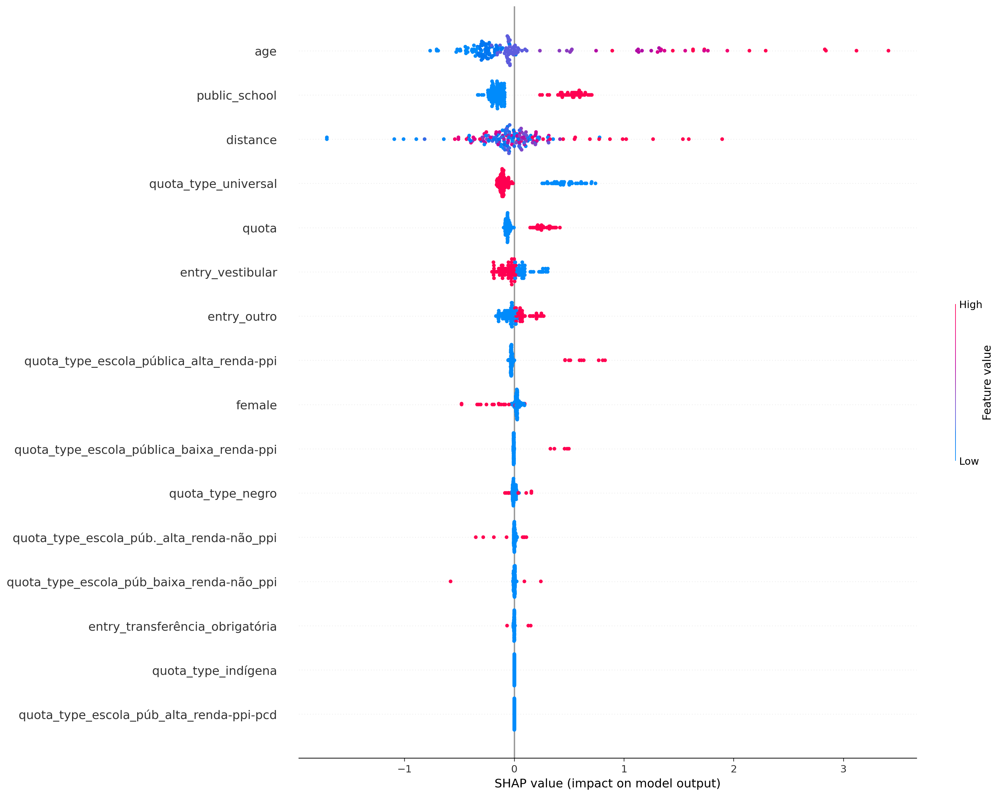
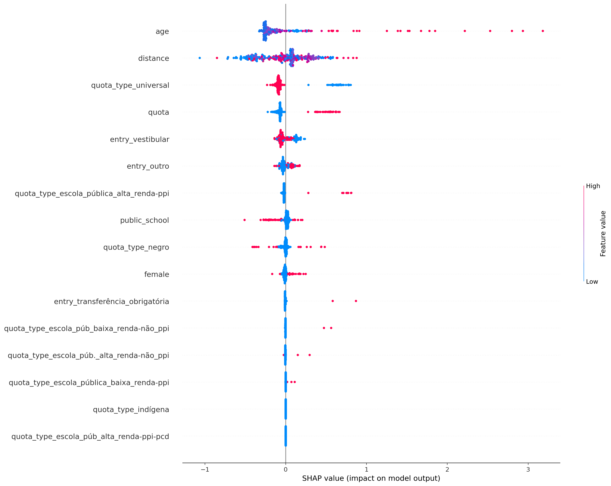
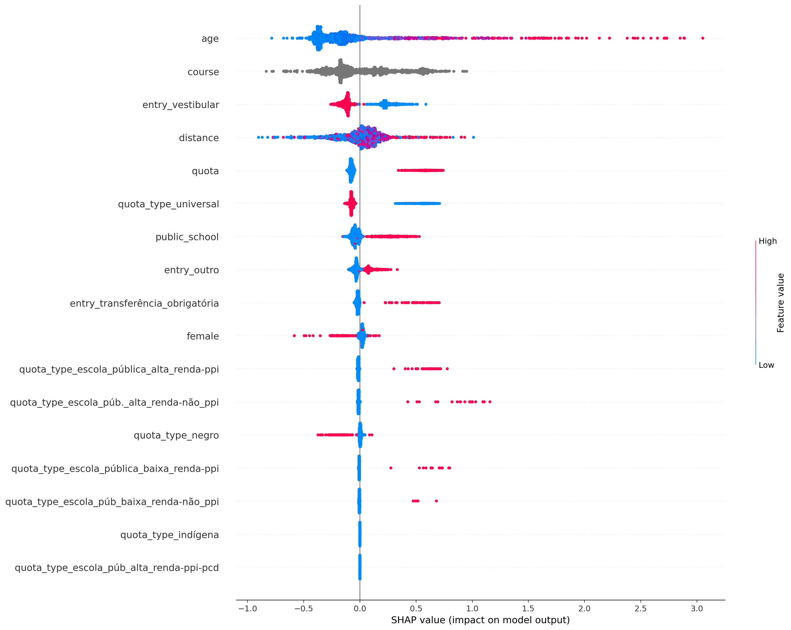

# Resultados

* Timeframe completo
* Apenas atributos sociodemográficos

## ciência_da_computação
Treino:
*   Accuracy = 69.38%
*   Precision = 65.89%
*   Recall = 91.53%
*   FScore = 78.94%

Teste:
*   Accuracy = 59.46%
*   Precision = 59.39%
*   Recall = 81.75%
*   FScore = 70.82%

## computação
Treino:
*   Accuracy = 81.41%
*   Precision = 81.68%
*   Recall = 95.86%
*   FScore = 89.49%

Teste:
*   Accuracy = 68.55%
*   Precision = 73.98%
*   Recall = 87.41%
*   FScore = 81.36%

## engenharia_de_computação
Treino:
*   Accuracy = 76.98%
*   Precision = 75.91%
*   Recall = 94.26%
*   FScore = 85.76%

Teste:
*   Accuracy = 63.80%
*   Precision = 66.91%
*   Recall = 86.67%
*   FScore = 77.31%

## engenharia_mecatrônica
Treino:
*   Accuracy = 69.64%
*   Precision = 62.42%
*   Recall = 85.96%
*   FScore = 74.46%

Teste:
*   Accuracy = 60.06%
*   Precision = 55.00%
*   Recall = 74.83%
*   FScore = 65.20%

## all
Treino:
*   Accuracy = 68.78%
*   Precision = 66.97%
*   Recall = 92.67%
*   FScore = 80.08%

Teste:
*   Accuracy = 63.14%
*   Precision = 63.45%
*   Recall = 88.14%
*   FScore = 76.02%

