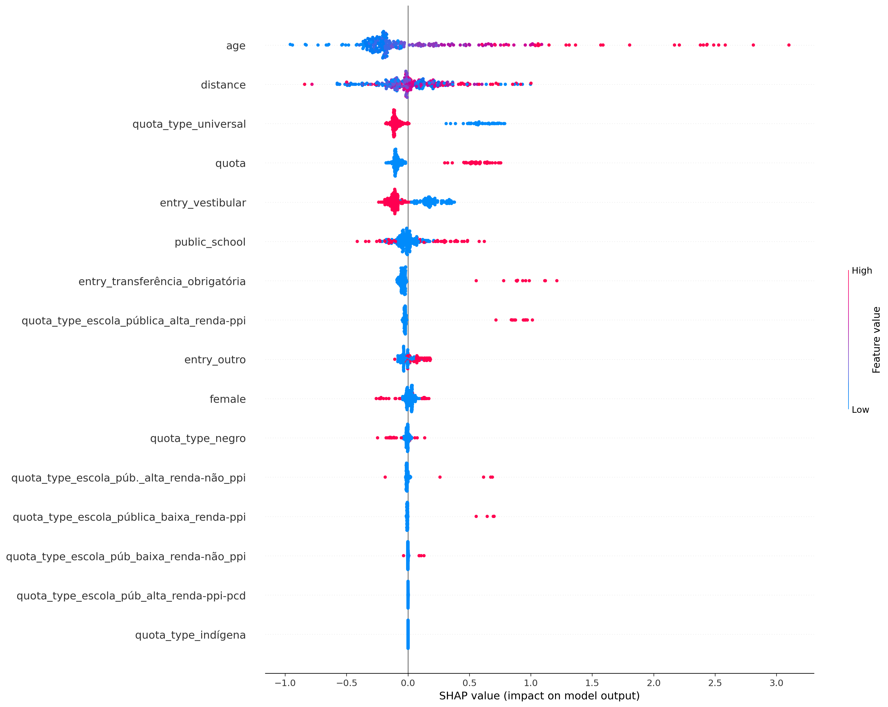
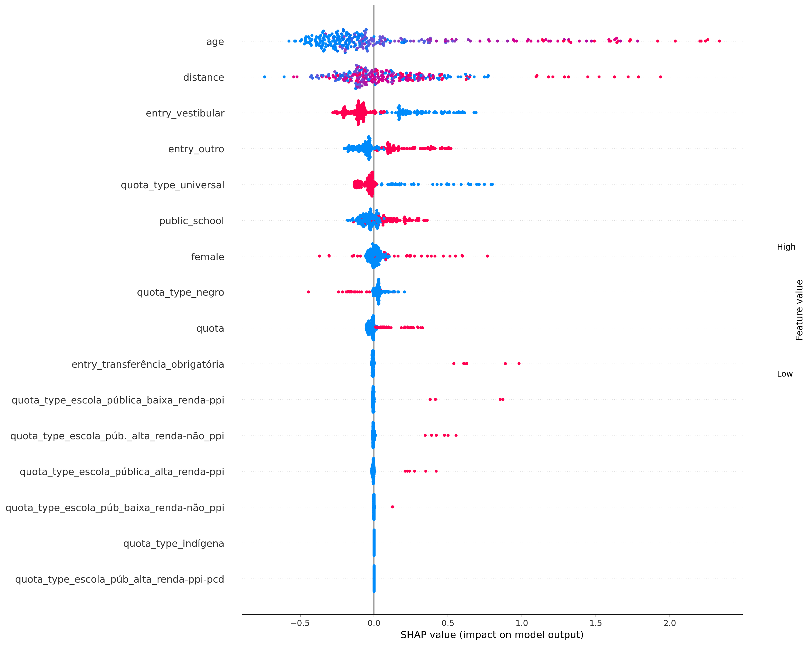
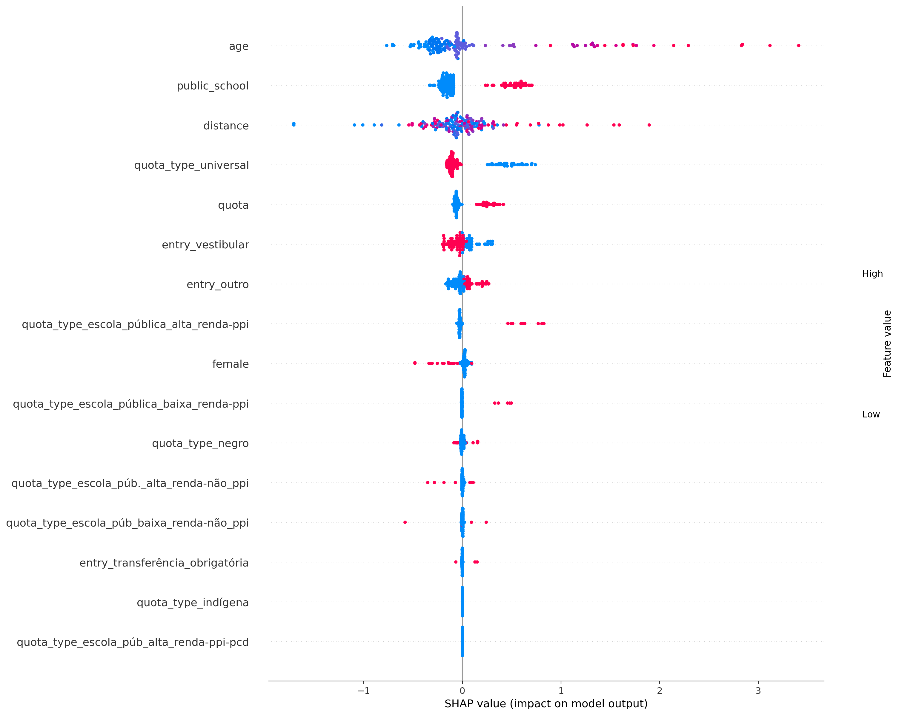
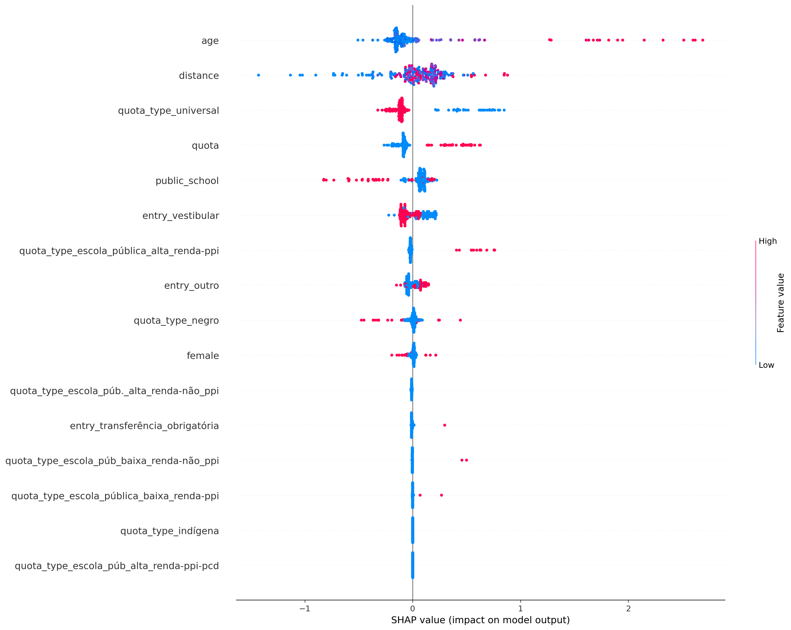
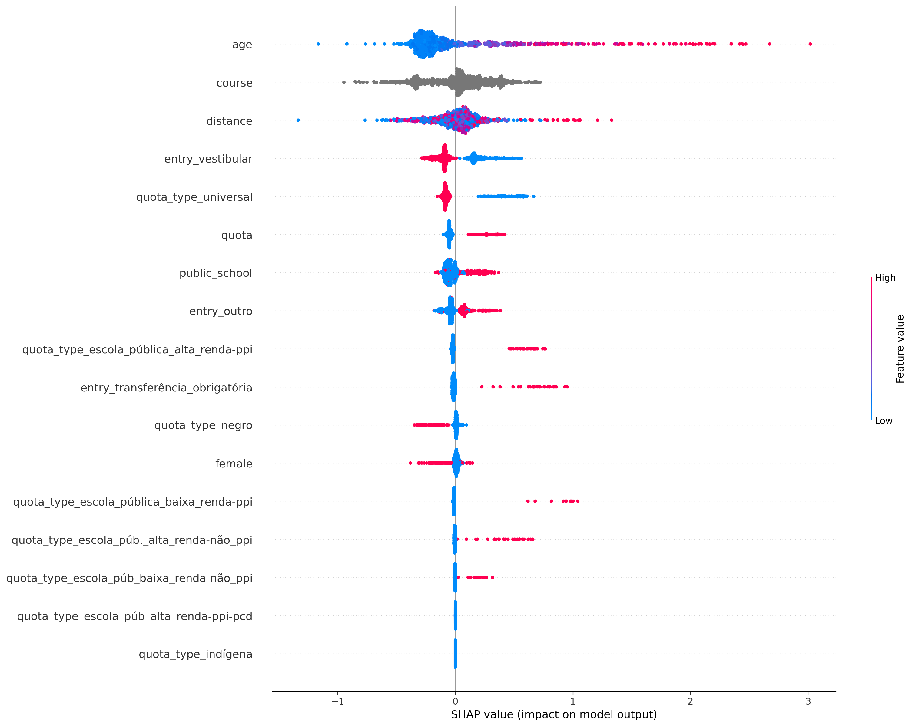

# Resultados

* Timeframe [2004, 2022]
* Apenas atributos sociodemográficos

## ciência_da_computação
Treino:
*   Accuracy = 73.54%
*   Precision = 71.98%
*   Recall = 96.03%
*   FScore = 84.46%

Teste:
*   Accuracy = 62.72%
*   Precision = 65.08%
*   Recall = 89.62%
*   FScore = 77.62%

## computação
Treino:
*   Accuracy = 84.62%
*   Precision = 84.00%
*   Recall = 98.37%
*   FScore = 91.93%

Teste:
*   Accuracy = 72.76%
*   Precision = 75.47%
*   Recall = 94.79%
*   FScore = 85.79%

## engenharia_de_computação
Treino:
*   Accuracy = 76.98%
*   Precision = 75.91%
*   Recall = 94.26%
*   FScore = 85.76%

Teste:
*   Accuracy = 63.80%
*   Precision = 66.91%
*   Recall = 86.67%
*   FScore = 77.31%

## engenharia_mecatrônica
Treino:
*   Accuracy = 73.32%
*   Precision = 69.33%
*   Recall = 87.94%
*   FScore = 79.22%

Teste:
*   Accuracy = 62.56%
*   Precision = 60.13%
*   Recall = 83.64%
*   FScore = 72.09%

## all
Treino:
*   Accuracy = 71.95%
*   Precision = 70.86%
*   Recall = 96.41%
*   FScore = 84.00%

Teste:
*   Accuracy = 66.13%
*   Precision = 67.38%
*   Recall = 92.61%
*   FScore = 80.29%

