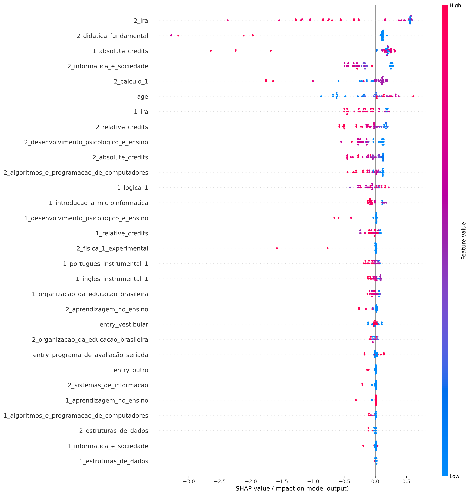
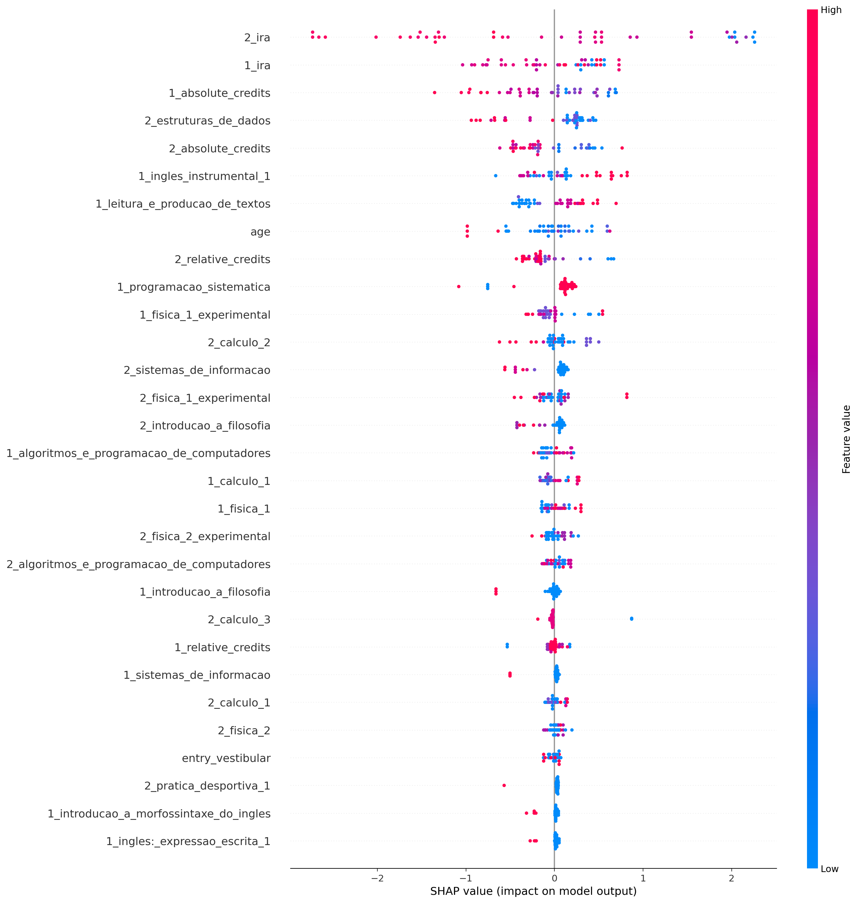
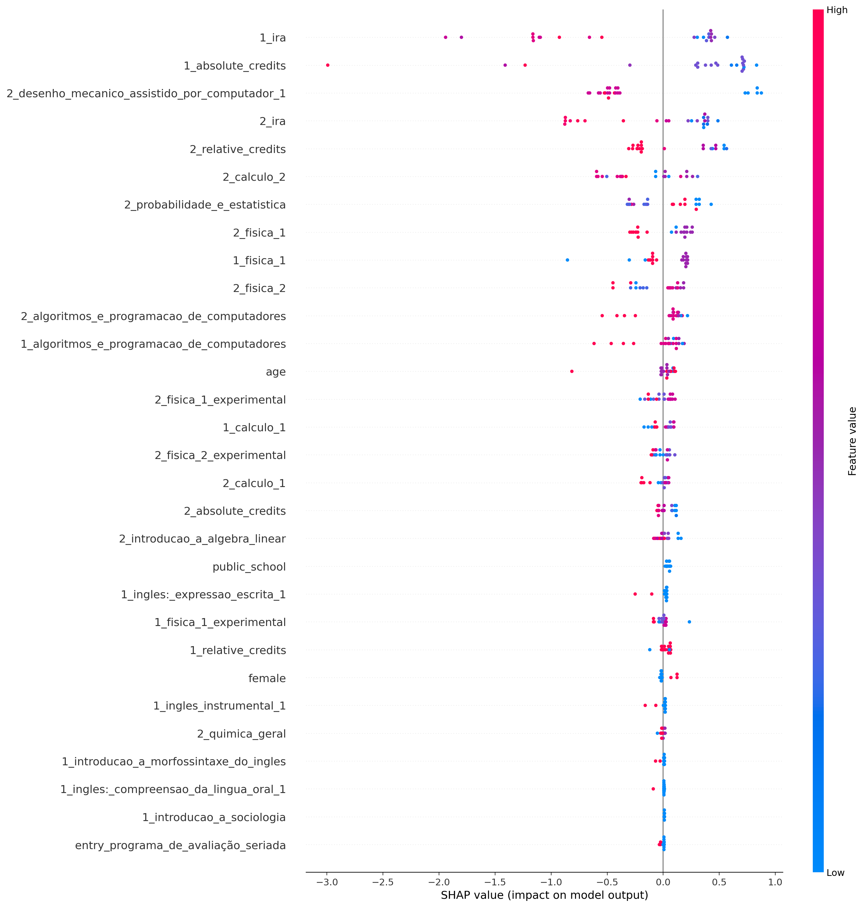
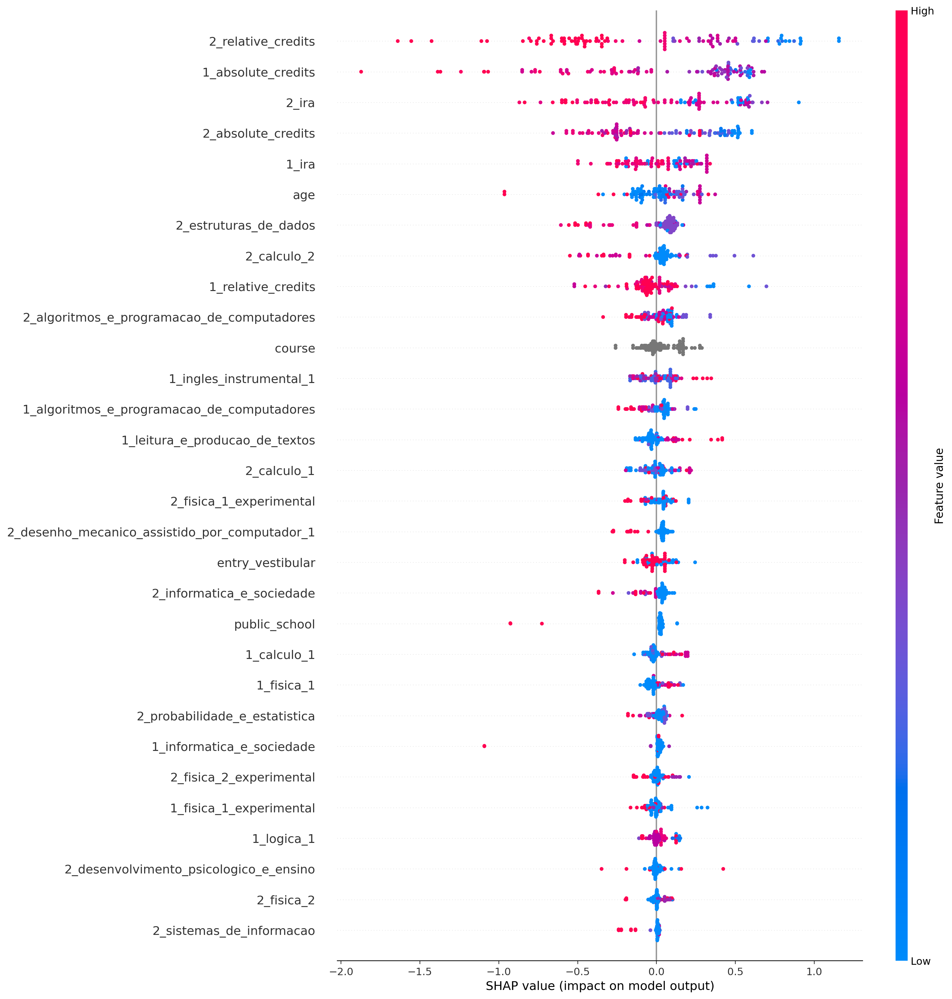

## computação
Treino:
*   Accuracy = 100.00%
*   Precision = 100.00%
*   Recall = 100.00%
*   FScore = 100.00%

Teste:
*   Accuracy = 89.19%
*   Precision = 100.00%
*   Recall = 84.62%
*   FScore = 90.31%

Parametros:
*   depth = 6
*   l2_leaf_reg = 3
*   learning_rate = 0.01

## ciência_da_computação
Treino:
*   Accuracy = 100.00%
*   Precision = 100.00%
*   Recall = 100.00%
*   FScore = 100.00%

Teste:
*   Accuracy = 84.09%
*   Precision = 90.00%
*   Recall = 78.26%
*   FScore = 82.68%

Parametros:
*   depth = 6
*   l2_leaf_reg = 1
*   learning_rate = 0.01

## engenharia_mecatrônica
Treino:
*   Accuracy = 100.00%
*   Precision = 100.00%
*   Recall = 100.00%
*   FScore = 100.00%

Teste:
*   Accuracy = 100.00%
*   Precision = 100.00%
*   Recall = 100.00%
*   FScore = 100.00%

Parametros:
*   depth = 4
*   l2_leaf_reg = 3
*   learning_rate = 0.01

## all
Treino:
*   Accuracy = 100.00%
*   Precision = 100.00%
*   Recall = 100.00%
*   FScore = 100.00%

Teste:
*   Accuracy = 95.10%
*   Precision = 94.92%
*   Recall = 96.55%
*   FScore = 95.87%

Parametros:
*   depth = 10
*   l2_leaf_reg = 5
*   learning_rate = 0.01

## computação
Treino:
*   Accuracy = 100.00%
*   Precision = 100.00%
*   Recall = 100.00%
*   FScore = 100.00%

Teste:
*   Accuracy = 89.19%
*   Precision = 100.00%
*   Recall = 84.62%
*   FScore = 90.31%

Parametros:
*   depth = 6
*   l2_leaf_reg = 3
*   learning_rate = 0.01

## computação
Treino:
*   Accuracy = 100.00%
*   Precision = 100.00%
*   Recall = 100.00%
*   FScore = 100.00%

Teste:
*   Accuracy = 89.19%
*   Precision = 100.00%
*   Recall = 84.62%
*   FScore = 90.31%

Parametros:
*   depth = 6
*   l2_leaf_reg = 3
*   learning_rate = 0.01

## ciência_da_computação
Treino:
*   Accuracy = 100.00%
*   Precision = 100.00%
*   Recall = 100.00%
*   FScore = 100.00%

Teste:
*   Accuracy = 84.09%
*   Precision = 90.00%
*   Recall = 78.26%
*   FScore = 82.68%

Parametros:
*   depth = 6
*   l2_leaf_reg = 1
*   learning_rate = 0.01

## engenharia_mecatrônica
Treino:
*   Accuracy = 100.00%
*   Precision = 100.00%
*   Recall = 100.00%
*   FScore = 100.00%

Teste:
*   Accuracy = 100.00%
*   Precision = 100.00%
*   Recall = 100.00%
*   FScore = 100.00%

Parametros:
*   depth = 4
*   l2_leaf_reg = 3
*   learning_rate = 0.01

## all
Treino:
*   Accuracy = 100.00%
*   Precision = 100.00%
*   Recall = 100.00%
*   FScore = 100.00%

Teste:
*   Accuracy = 95.10%
*   Precision = 94.92%
*   Recall = 96.55%
*   FScore = 95.87%

Parametros:
*   depth = 10
*   l2_leaf_reg = 5
*   learning_rate = 0.01

## computação
Treino:
*   Accuracy = 100.00%
*   Precision = 100.00%
*   Recall = 100.00%
*   FScore = 100.00%

Teste:
*   Accuracy = 89.19%
*   Precision = 100.00%
*   Recall = 84.62%
*   FScore = 90.31%

Parametros:
*   depth = 6
*   l2_leaf_reg = 3
*   learning_rate = 0.01

