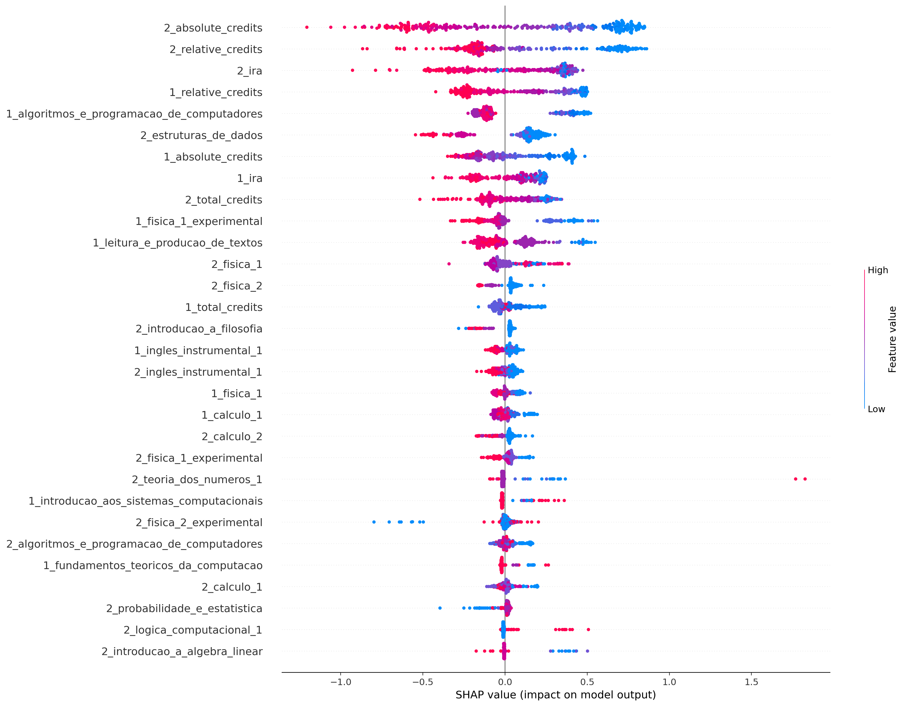
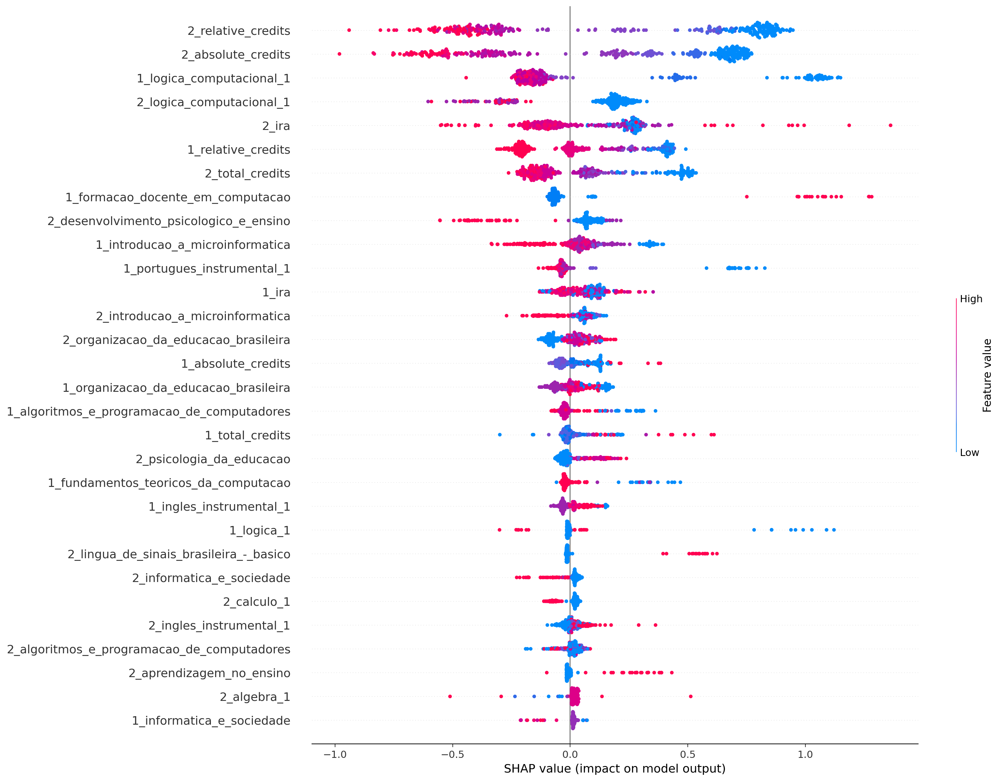
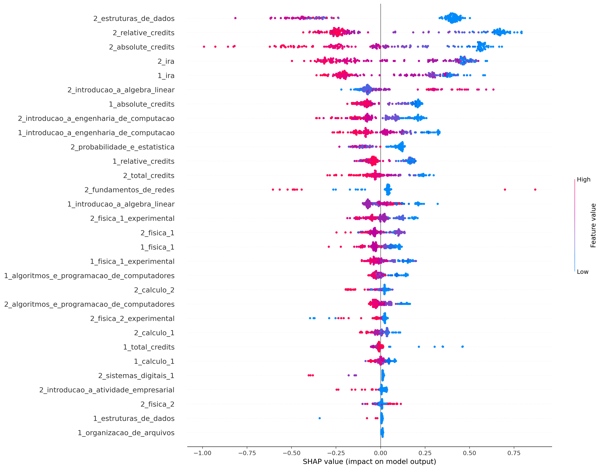
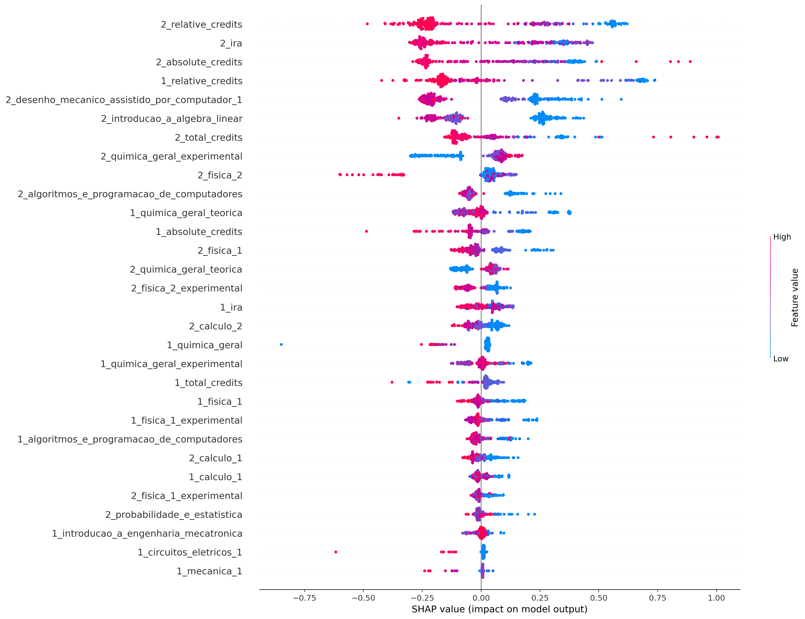
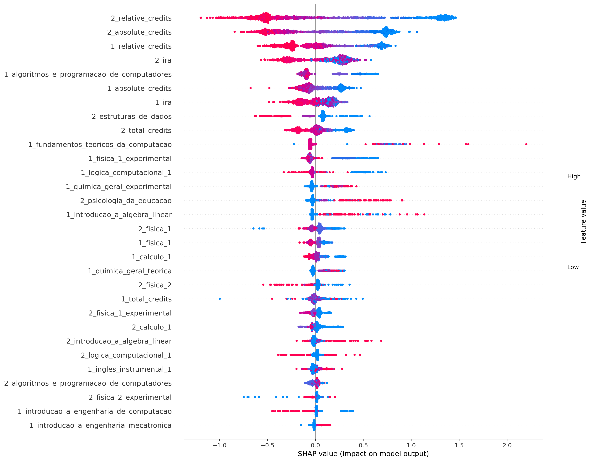

## ciência_da_computação
Treino:
*   Accuracy = 92.23%
*   Precision = 92.26%
*   Recall = 95.77%
*   FScore = 94.30%

Teste:
*   Accuracy = 79.75%
*   Precision = 81.36%
*   Recall = 88.18%
*   FScore = 85.25%

## computação
Treino:
*   Accuracy = 93.00%
*   Precision = 94.90%
*   Recall = 95.91%
*   FScore = 95.50%

Teste:
*   Accuracy = 81.19%
*   Precision = 84.73%
*   Recall = 91.74%
*   FScore = 88.73%

## engenharia_de_computação
Treino:
*   Accuracy = 90.65%
*   Precision = 90.10%
*   Recall = 96.35%
*   FScore = 93.69%

Teste:
*   Accuracy = 80.00%
*   Precision = 82.03%
*   Recall = 88.98%
*   FScore = 86.00%

## engenharia_mecatrônica
Treino:
*   Accuracy = 87.48%
*   Precision = 86.81%
*   Recall = 90.42%
*   FScore = 88.90%

Teste:
*   Accuracy = 76.10%
*   Precision = 73.29%
*   Recall = 87.41%
*   FScore = 81.01%

## all
Treino:
*   Accuracy = 87.24%
*   Precision = 87.49%
*   Recall = 93.85%
*   FScore = 91.13%

Teste:
*   Accuracy = 78.46%
*   Precision = 80.18%
*   Recall = 88.94%
*   FScore = 85.13%

