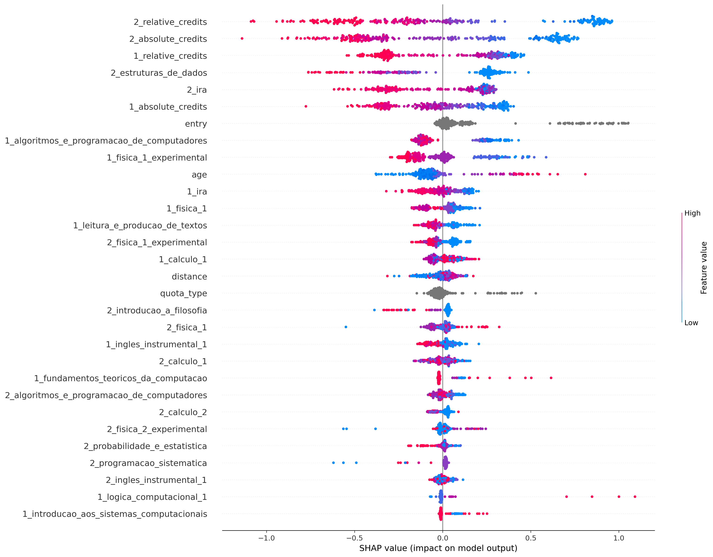
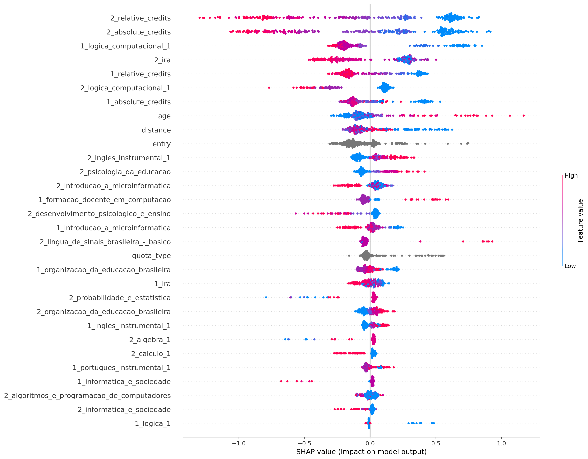
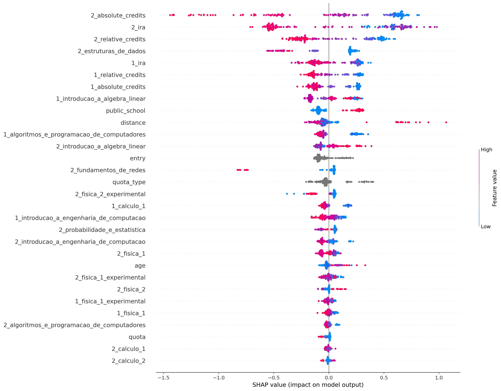
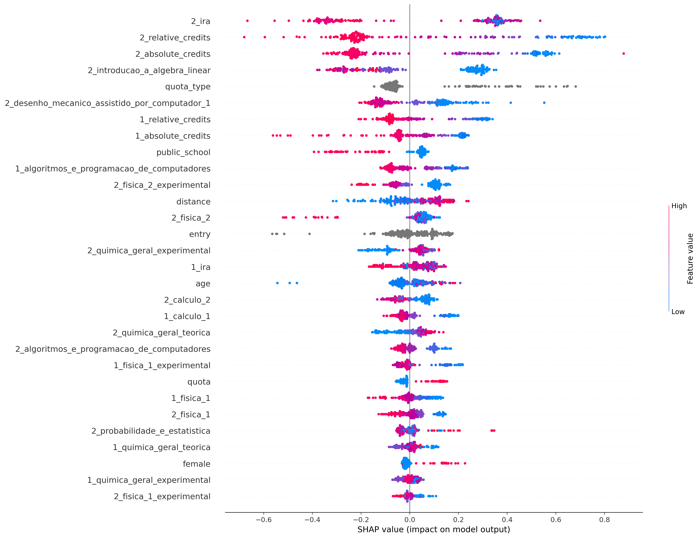
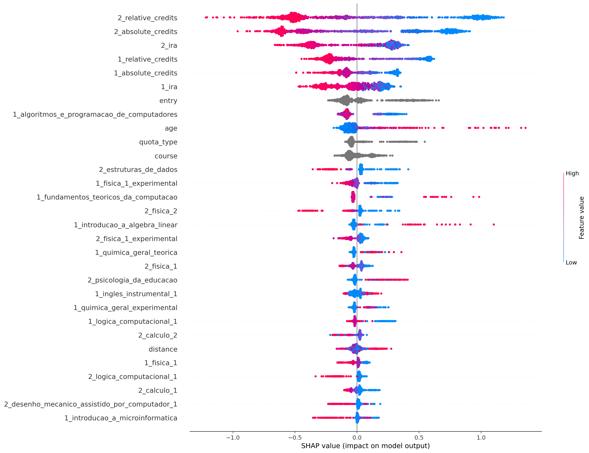

## ciência_da_computação
Treino:
*   Accuracy = 94.92%
*   Precision = 96.56%
*   Recall = 95.39%
*   FScore = 95.87%

Teste:
*   Accuracy = 79.21%
*   Precision = 83.24%
*   Recall = 84.18%
*   FScore = 83.79%

Parametros:
*   depth = 6
*   l2_leaf_reg = 3
*   learning_rate = 0.01

## computação
Treino:
*   Accuracy = 96.49%
*   Precision = 97.28%
*   Recall = 98.10%
*   FScore = 97.76%

Teste:
*   Accuracy = 81.41%
*   Precision = 85.92%
*   Recall = 90.15%
*   FScore = 88.36%

Parametros:
*   depth = 6
*   l2_leaf_reg = 5
*   learning_rate = 0.01

## engenharia_de_computação
Treino:
*   Accuracy = 89.87%
*   Precision = 88.59%
*   Recall = 96.68%
*   FScore = 93.19%

Teste:
*   Accuracy = 72.67%
*   Precision = 74.59%
*   Recall = 87.50%
*   FScore = 81.70%

Parametros:
*   depth = 4
*   l2_leaf_reg = 3
*   learning_rate = 0.01

## engenharia_mecatrônica
Treino:
*   Accuracy = 89.33%
*   Precision = 85.97%
*   Recall = 95.22%
*   FScore = 91.20%

Teste:
*   Accuracy = 78.05%
*   Precision = 73.33%
*   Recall = 91.67%
*   FScore = 83.15%

Parametros:
*   depth = 6
*   l2_leaf_reg = 5
*   learning_rate = 0.01

## all
Treino:
*   Accuracy = 85.39%
*   Precision = 84.63%
*   Recall = 94.63%
*   FScore = 90.26%

Teste:
*   Accuracy = 79.85%
*   Precision = 80.42%
*   Recall = 91.03%
*   FScore = 86.36%

Parametros:
*   depth = 6
*   l2_leaf_reg = 3
*   learning_rate = 0.01

