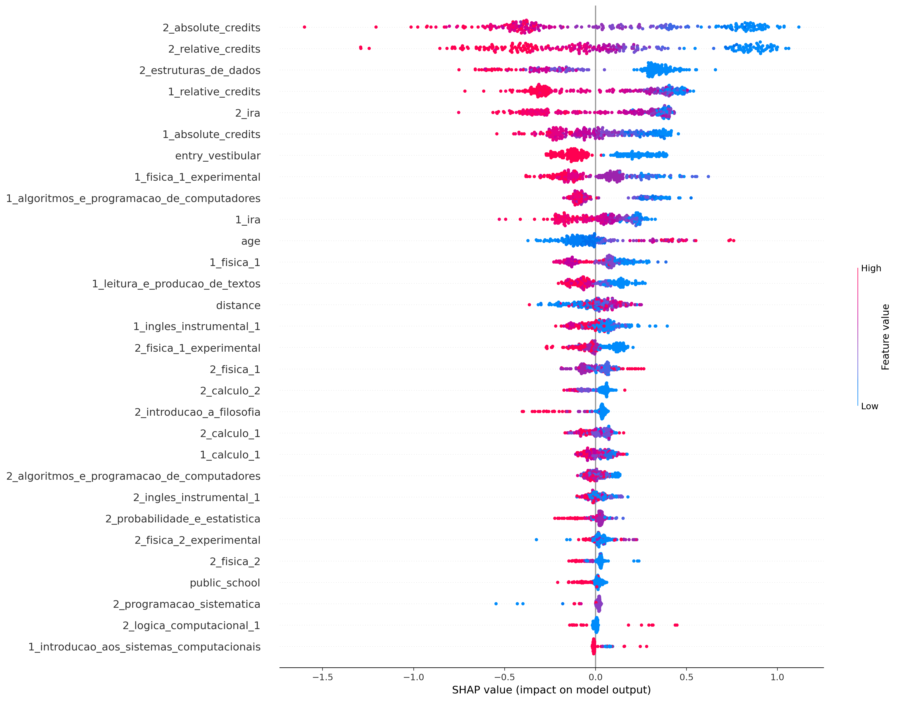
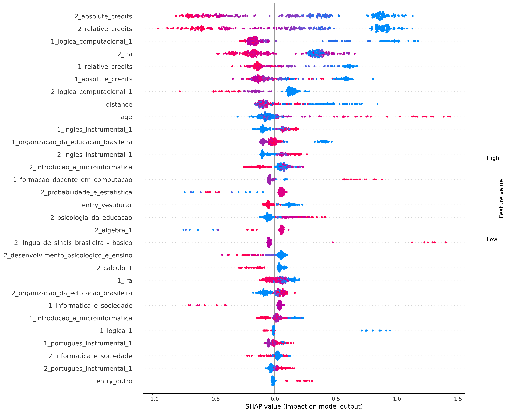
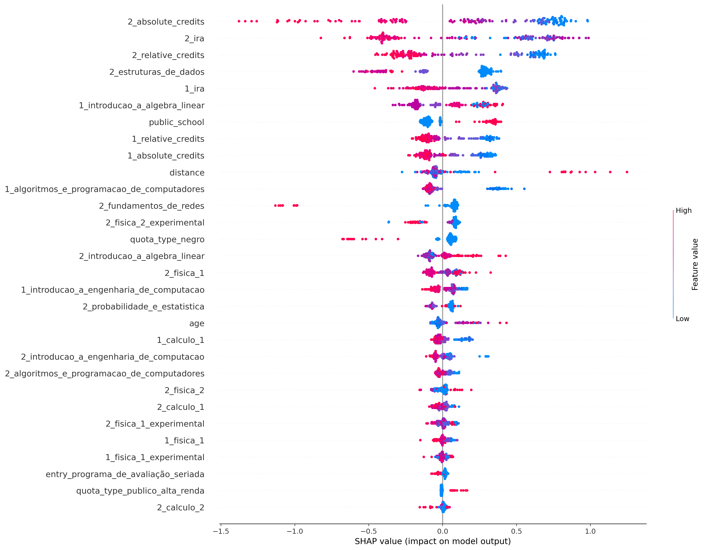
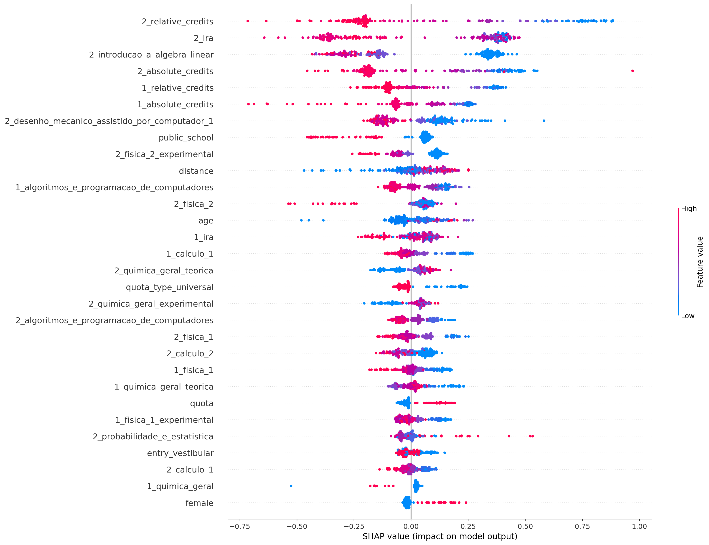
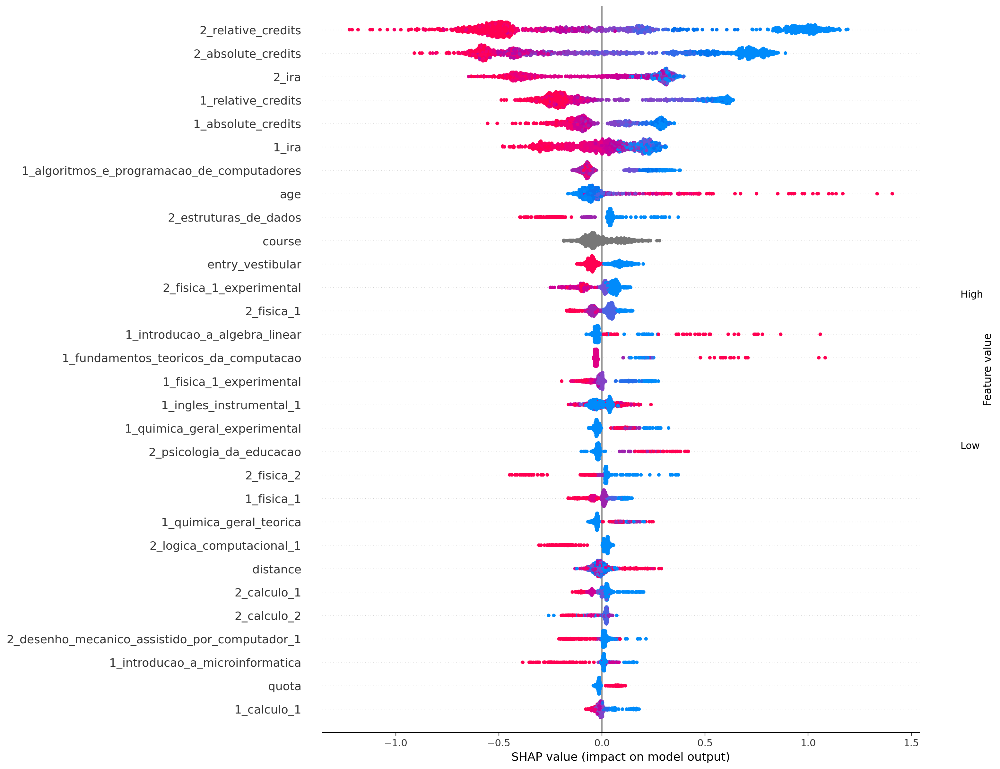

## ciência_da_computação
Treino:
*   Accuracy = 98.61%
*   Precision = 98.32%
*   Recall = 99.51%
*   FScore = 99.02%

Teste:
*   Accuracy = 79.21%
*   Precision = 83.24%
*   Recall = 84.18%
*   FScore = 83.79%

Parametros:
*   depth = 10
*   l2_leaf_reg = 5
*   learning_rate = 0.01

## computação
Treino:
*   Accuracy = 96.33%
*   Precision = 97.67%
*   Recall = 97.47%
*   FScore = 97.55%

Teste:
*   Accuracy = 80.67%
*   Precision = 85.78%
*   Recall = 89.16%
*   FScore = 87.75%

Parametros:
*   depth = 4
*   l2_leaf_reg = 1
*   learning_rate = 0.01

## engenharia_de_computação
Treino:
*   Accuracy = 91.47%
*   Precision = 89.73%
*   Recall = 97.93%
*   FScore = 94.39%

Teste:
*   Accuracy = 73.91%
*   Precision = 75.83%
*   Recall = 87.50%
*   FScore = 82.31%

Parametros:
*   depth = 4
*   l2_leaf_reg = 3
*   learning_rate = 0.01

## engenharia_mecatrônica
Treino:
*   Accuracy = 93.31%
*   Precision = 91.01%
*   Recall = 96.81%
*   FScore = 94.35%

Teste:
*   Accuracy = 77.56%
*   Precision = 74.60%
*   Recall = 87.04%
*   FScore = 81.47%

Parametros:
*   depth = 6
*   l2_leaf_reg = 5
*   learning_rate = 0.01

## all
Treino:
*   Accuracy = 85.81%
*   Precision = 84.76%
*   Recall = 95.21%
*   FScore = 90.63%

Teste:
*   Accuracy = 80.39%
*   Precision = 80.84%
*   Recall = 91.37%
*   FScore = 86.74%

Parametros:
*   depth = 6
*   l2_leaf_reg = 5
*   learning_rate = 0.01

