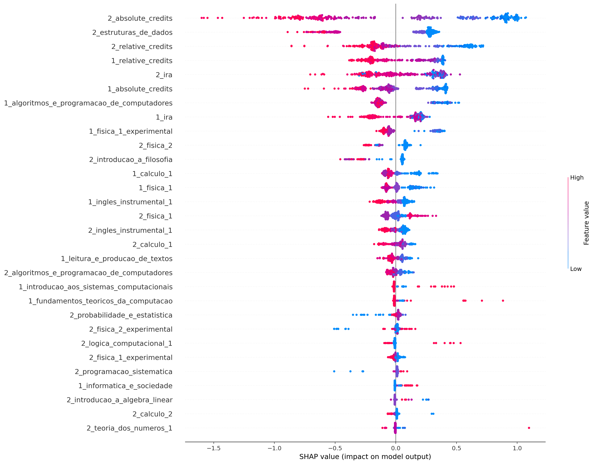
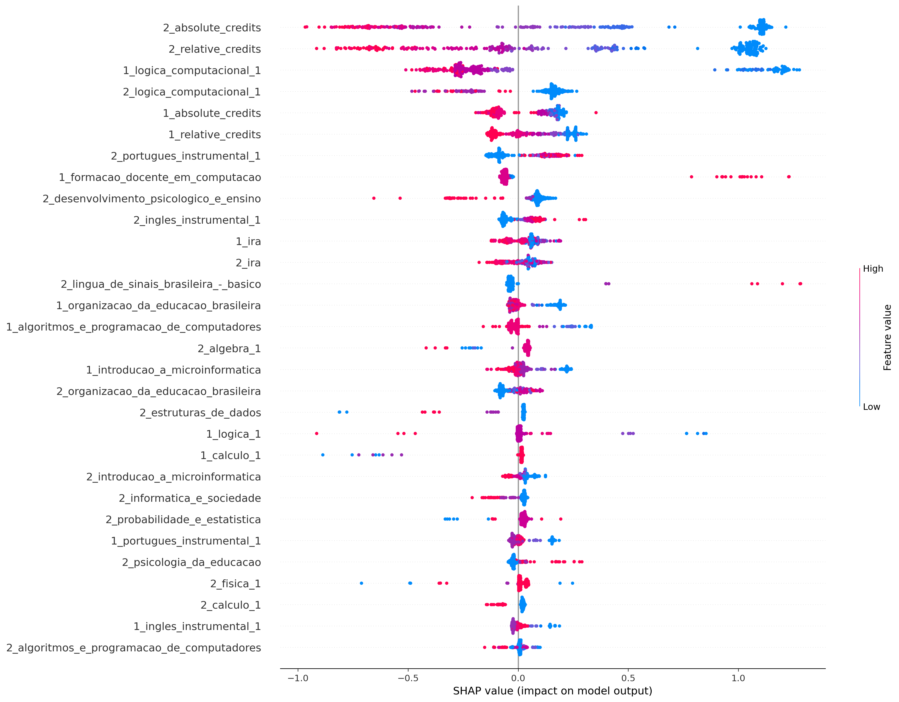
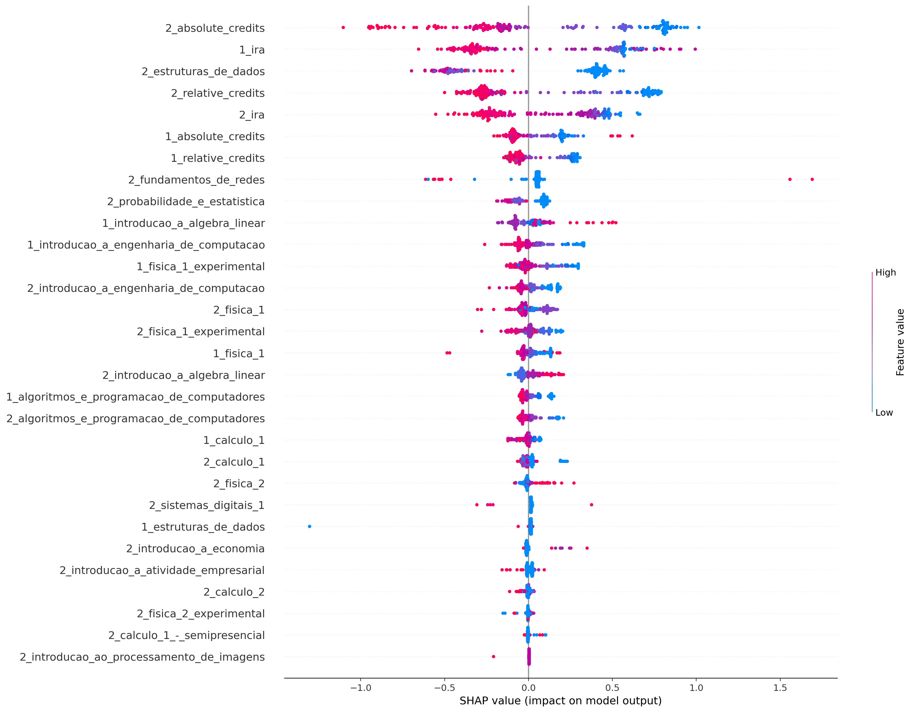
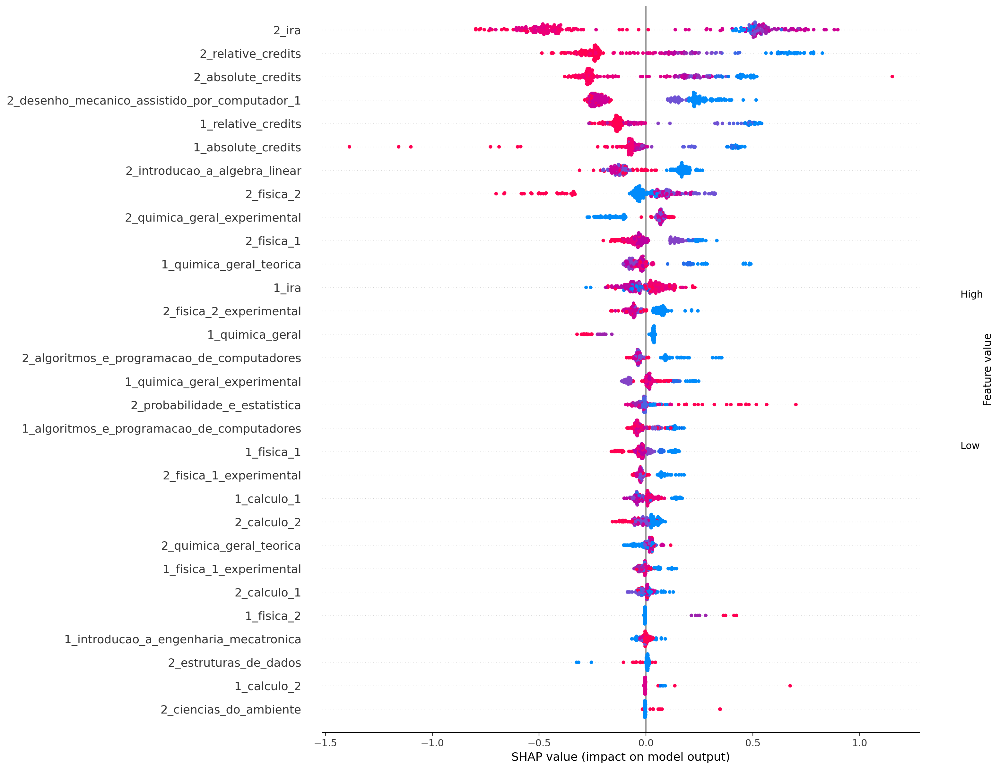
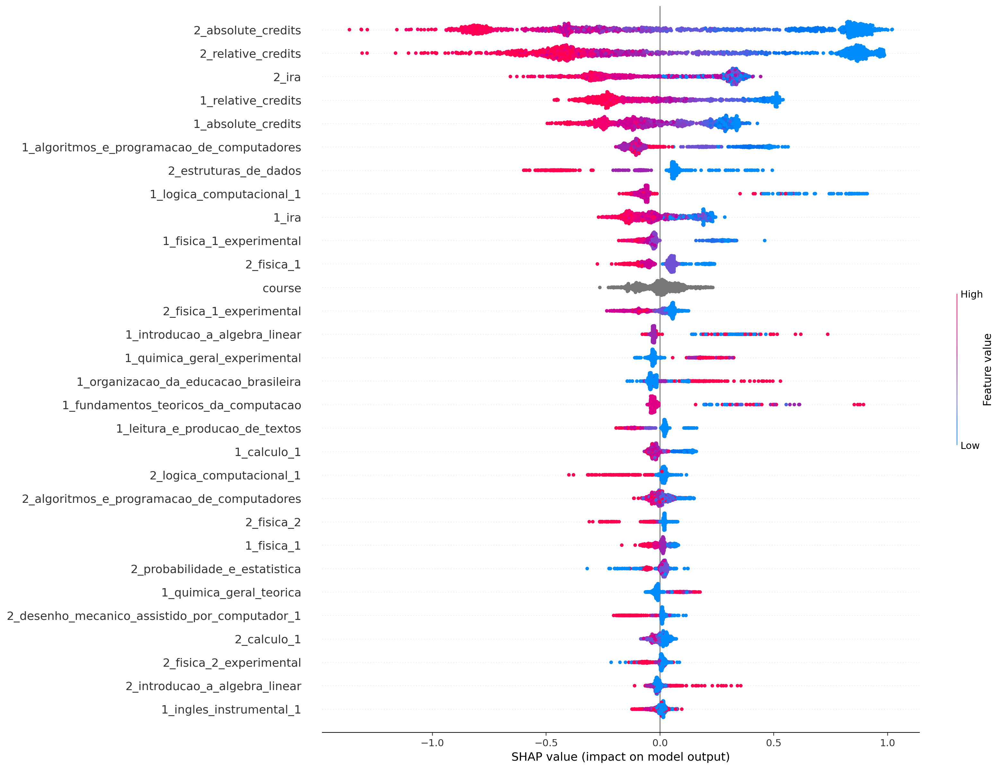

## ciência_da_computação
Treino:
*   Accuracy = 92.00%
*   Precision = 95.25%
*   Recall = 91.92%
*   FScore = 93.26%

Teste:
*   Accuracy = 76.53%
*   Precision = 83.61%
*   Recall = 78.06%
*   FScore = 80.24%

Parametros:
*   depth = 4
*   l2_leaf_reg = 7
*   learning_rate = 0.01

## computação
Treino:
*   Accuracy = 89.42%
*   Precision = 88.89%
*   Recall = 98.35%
*   FScore = 94.24%

Teste:
*   Accuracy = 80.19%
*   Precision = 80.57%
*   Recall = 97.44%
*   FScore = 89.73%

Parametros:
*   depth = 4
*   l2_leaf_reg = 3
*   learning_rate = 0.01

## engenharia_de_computação
Treino:
*   Accuracy = 90.60%
*   Precision = 90.03%
*   Recall = 96.32%
*   FScore = 93.64%

Teste:
*   Accuracy = 75.98%
*   Precision = 79.53%
*   Recall = 85.59%
*   FScore = 83.00%

Parametros:
*   depth = 4
*   l2_leaf_reg = 3
*   learning_rate = 0.01

## engenharia_mecatrônica
Treino:
*   Accuracy = 88.89%
*   Precision = 86.53%
*   Recall = 94.14%
*   FScore = 90.86%

Teste:
*   Accuracy = 75.82%
*   Precision = 74.50%
*   Recall = 84.09%
*   FScore = 79.87%

Parametros:
*   depth = 4
*   l2_leaf_reg = 3
*   learning_rate = 0.01

## all
Treino:
*   Accuracy = 85.61%
*   Precision = 86.68%
*   Recall = 92.10%
*   FScore = 89.80%

Teste:
*   Accuracy = 79.73%
*   Precision = 81.71%
*   Recall = 88.81%
*   FScore = 85.75%

Parametros:
*   depth = 6
*   l2_leaf_reg = 5
*   learning_rate = 0.01

