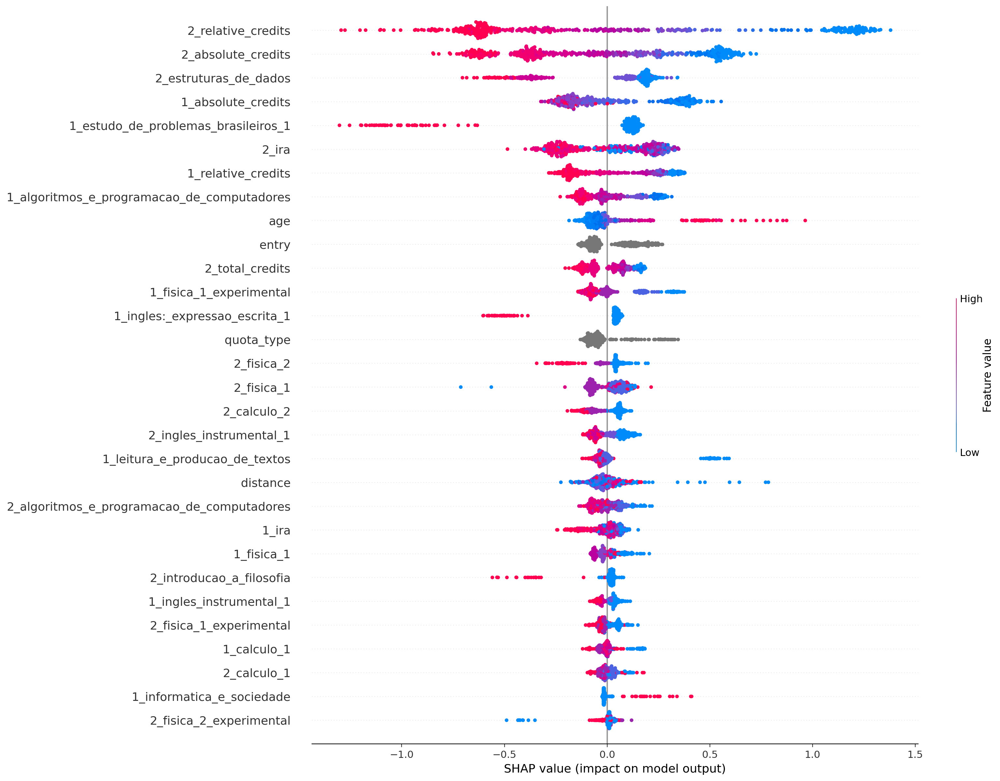
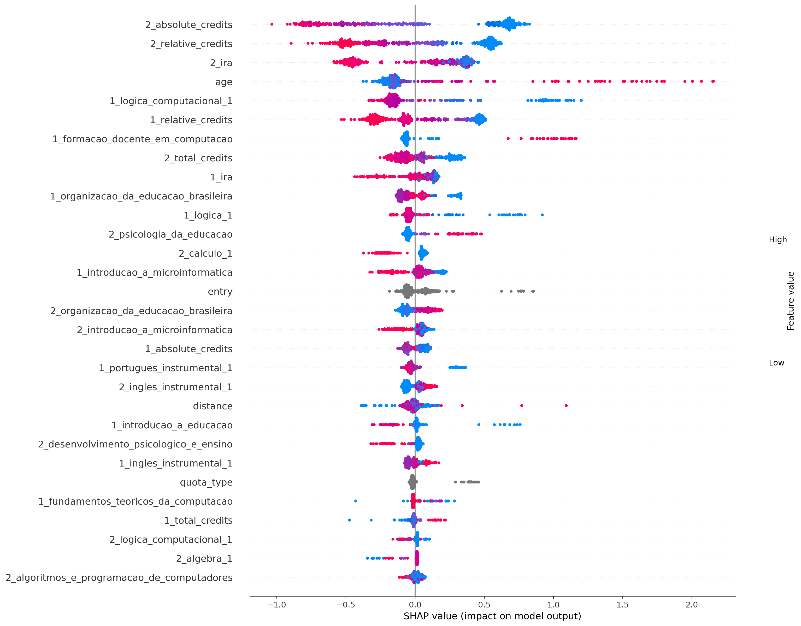
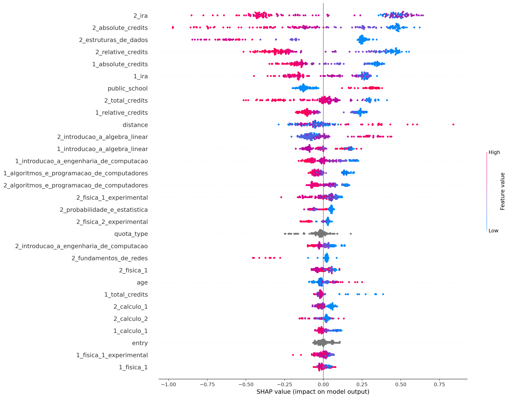
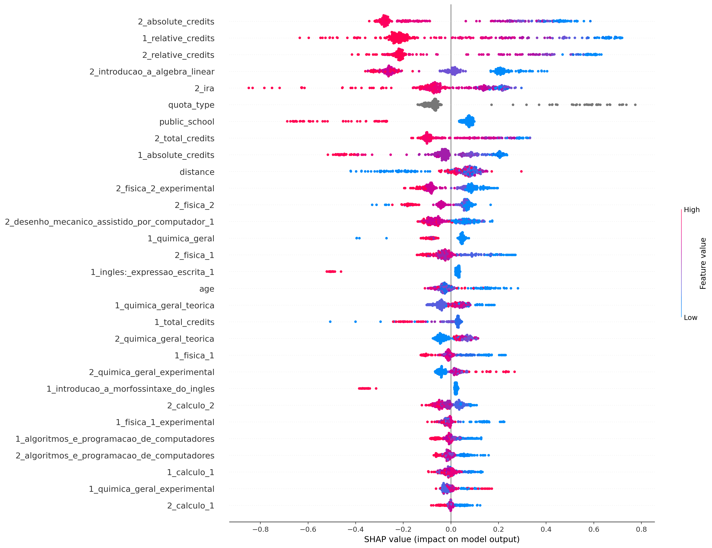
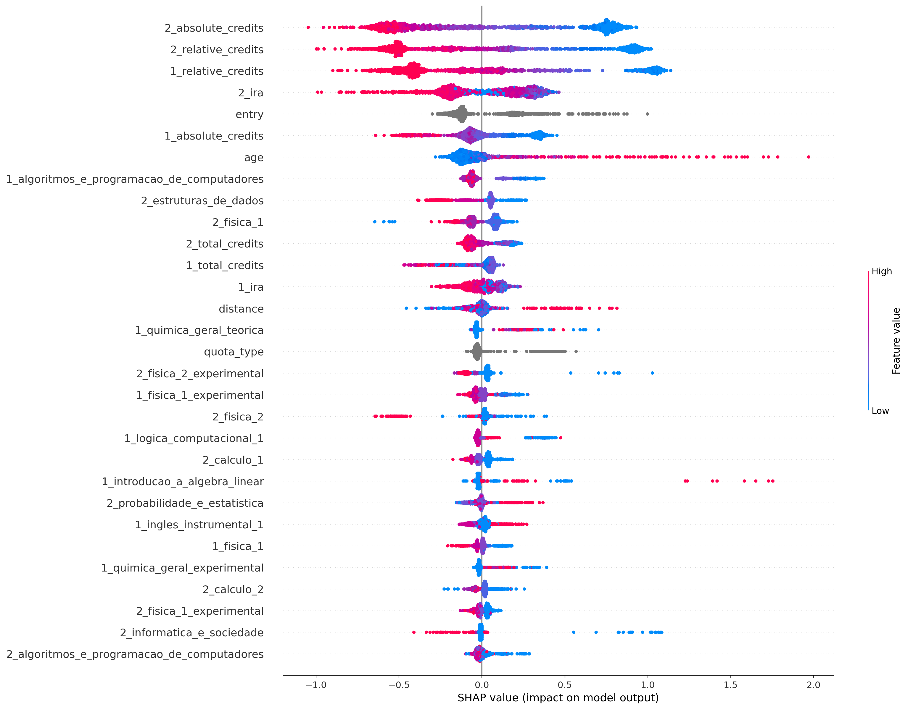

## ciência_da_computação
Treino:
*   Accuracy = 91.16%
*   Precision = 89.68%
*   Recall = 94.79%
*   FScore = 92.62%

Teste:
*   Accuracy = 79.63%
*   Precision = 78.75%
*   Recall = 85.93%
*   FScore = 82.83%

## computação
Treino:
*   Accuracy = 93.66%
*   Precision = 95.41%
*   Recall = 95.87%
*   FScore = 95.68%

Teste:
*   Accuracy = 77.69%
*   Precision = 83.51%
*   Recall = 86.30%
*   FScore = 85.13%

## engenharia_de_computação
Treino:
*   Accuracy = 92.06%
*   Precision = 92.13%
*   Recall = 95.90%
*   FScore = 94.32%

Teste:
*   Accuracy = 76.69%
*   Precision = 78.63%
*   Recall = 87.62%
*   FScore = 83.70%

## engenharia_mecatrônica
Treino:
*   Accuracy = 86.91%
*   Precision = 81.65%
*   Recall = 92.40%
*   FScore = 87.67%

Teste:
*   Accuracy = 72.33%
*   Precision = 68.32%
*   Recall = 74.83%
*   FScore = 72.02%

## all
Treino:
*   Accuracy = 87.32%
*   Precision = 87.40%
*   Recall = 91.69%
*   FScore = 89.88%

Teste:
*   Accuracy = 78.00%
*   Precision = 79.69%
*   Recall = 84.06%
*   FScore = 82.21%

