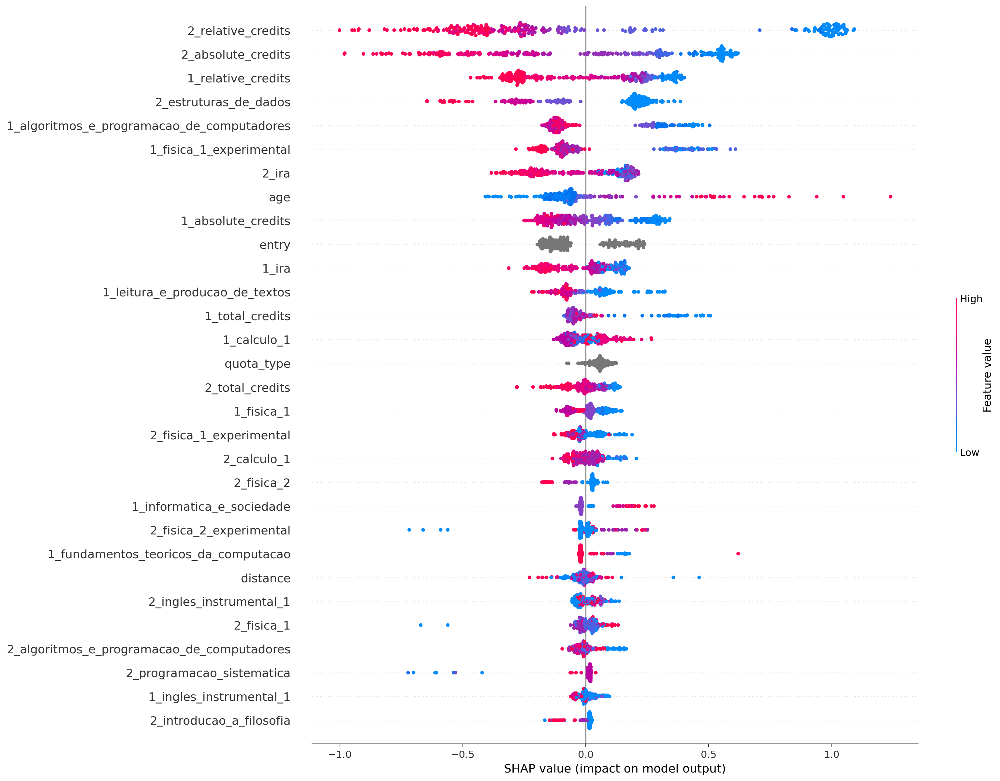
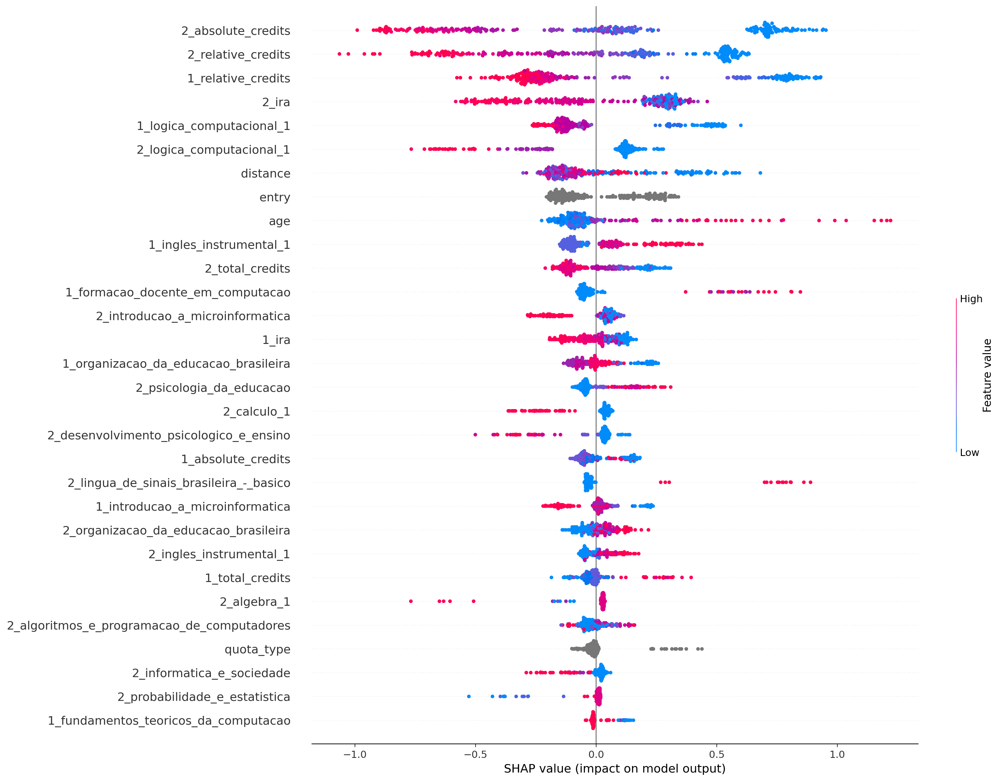
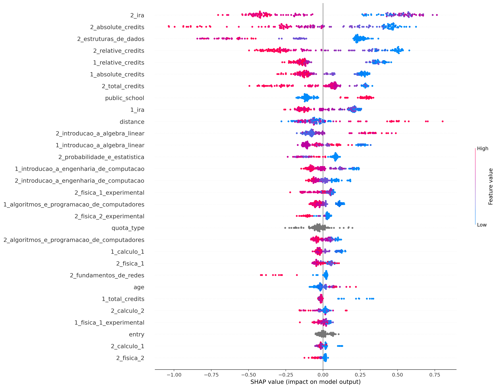
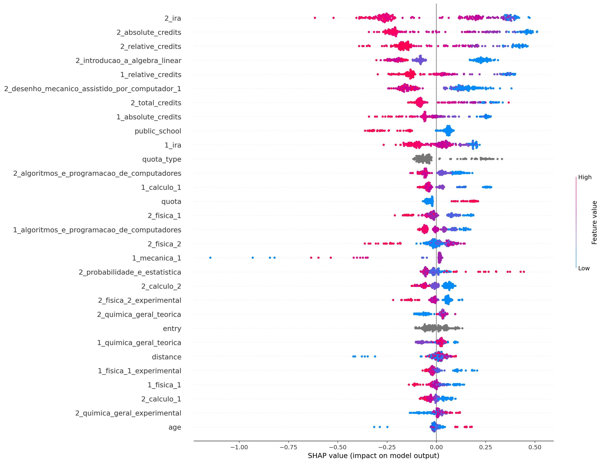
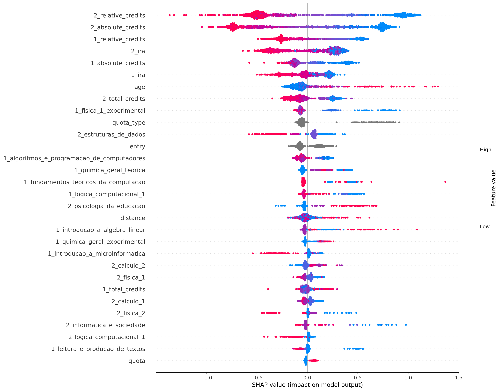

## ciência_da_computação
Treino:
*   Accuracy = 93.27%
*   Precision = 95.49%
*   Recall = 93.93%
*   FScore = 94.56%

Teste:
*   Accuracy = 81.53%
*   Precision = 84.57%
*   Recall = 86.89%
*   FScore = 85.92%

## computação
Treino:
*   Accuracy = 96.16%
*   Precision = 98.95%
*   Recall = 95.93%
*   FScore = 97.15%

Teste:
*   Accuracy = 79.93%
*   Precision = 86.38%
*   Recall = 87.20%
*   FScore = 86.87%

## engenharia_de_computação
Treino:
*   Accuracy = 91.27%
*   Precision = 89.51%
*   Recall = 97.95%
*   FScore = 94.31%

Teste:
*   Accuracy = 73.01%
*   Precision = 74.80%
*   Recall = 87.62%
*   FScore = 81.87%

## engenharia_mecatrônica
Treino:
*   Accuracy = 87.58%
*   Precision = 84.27%
*   Recall = 93.77%
*   FScore = 89.63%

Teste:
*   Accuracy = 79.62%
*   Precision = 74.10%
*   Recall = 93.64%
*   FScore = 84.51%

## all
Treino:
*   Accuracy = 86.67%
*   Precision = 86.35%
*   Recall = 94.37%
*   FScore = 90.91%

Teste:
*   Accuracy = 79.02%
*   Precision = 80.84%
*   Recall = 88.67%
*   FScore = 85.28%

