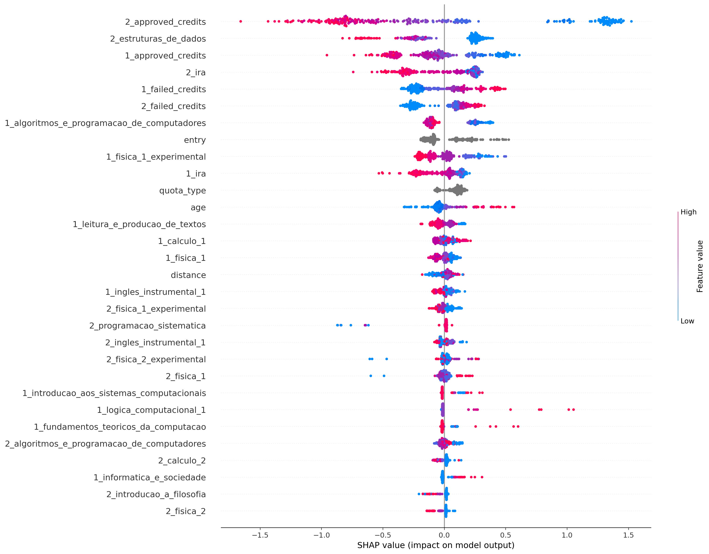
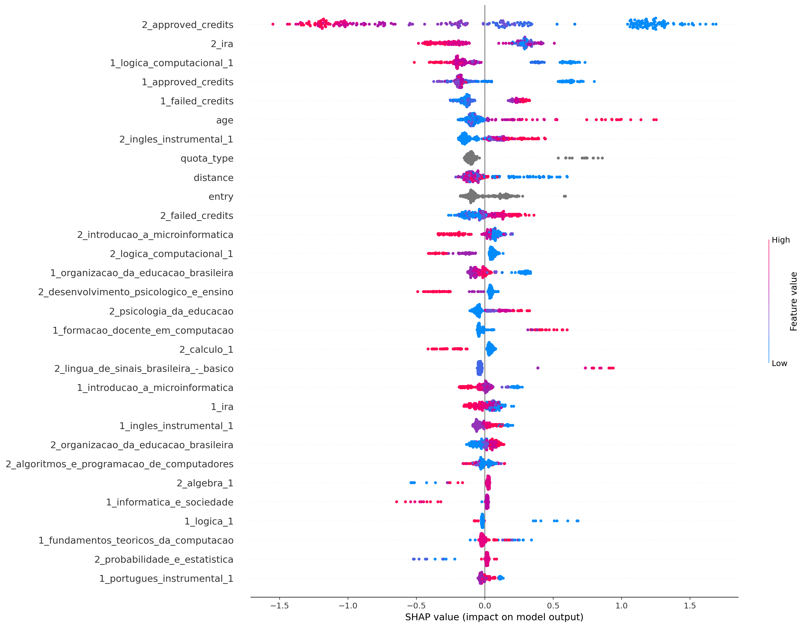
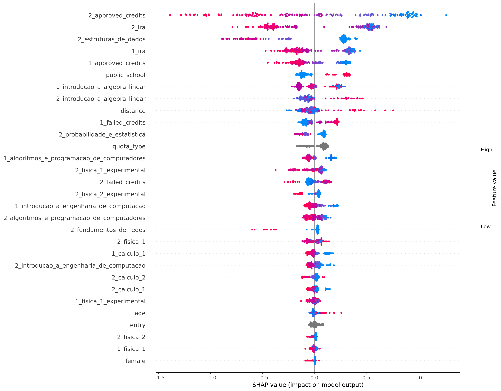
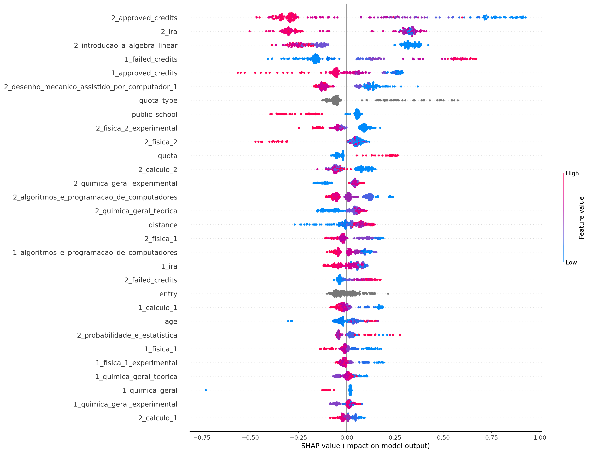
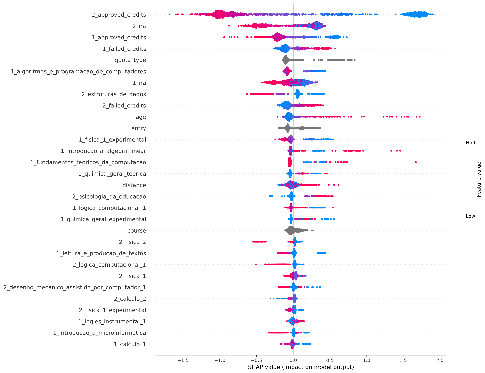

## ciência_da_computação
Treino:
*   Accuracy = 93.09%
*   Precision = 94.24%
*   Recall = 94.93%
*   FScore = 94.65%

Teste:
*   Accuracy = 80.65%
*   Precision = 83.61%
*   Recall = 86.44%
*   FScore = 85.26%

## computação
Treino:
*   Accuracy = 94.90%
*   Precision = 95.67%
*   Recall = 97.68%
*   FScore = 96.85%

Teste:
*   Accuracy = 80.00%
*   Precision = 85.05%
*   Recall = 89.22%
*   FScore = 87.46%

## engenharia_de_computação
Treino:
*   Accuracy = 91.49%
*   Precision = 90.73%
*   Recall = 96.71%
*   FScore = 94.17%

Teste:
*   Accuracy = 75.31%
*   Precision = 77.12%
*   Recall = 87.50%
*   FScore = 82.93%

## engenharia_mecatrônica
Treino:
*   Accuracy = 87.24%
*   Precision = 83.69%
*   Recall = 94.02%
*   FScore = 89.49%

Teste:
*   Accuracy = 78.54%
*   Precision = 73.53%
*   Recall = 92.59%
*   FScore = 83.70%

## all
Treino:
*   Accuracy = 86.83%
*   Precision = 87.18%
*   Recall = 93.42%
*   FScore = 90.76%

Teste:
*   Accuracy = 79.78%
*   Precision = 81.97%
*   Recall = 88.20%
*   FScore = 85.54%

