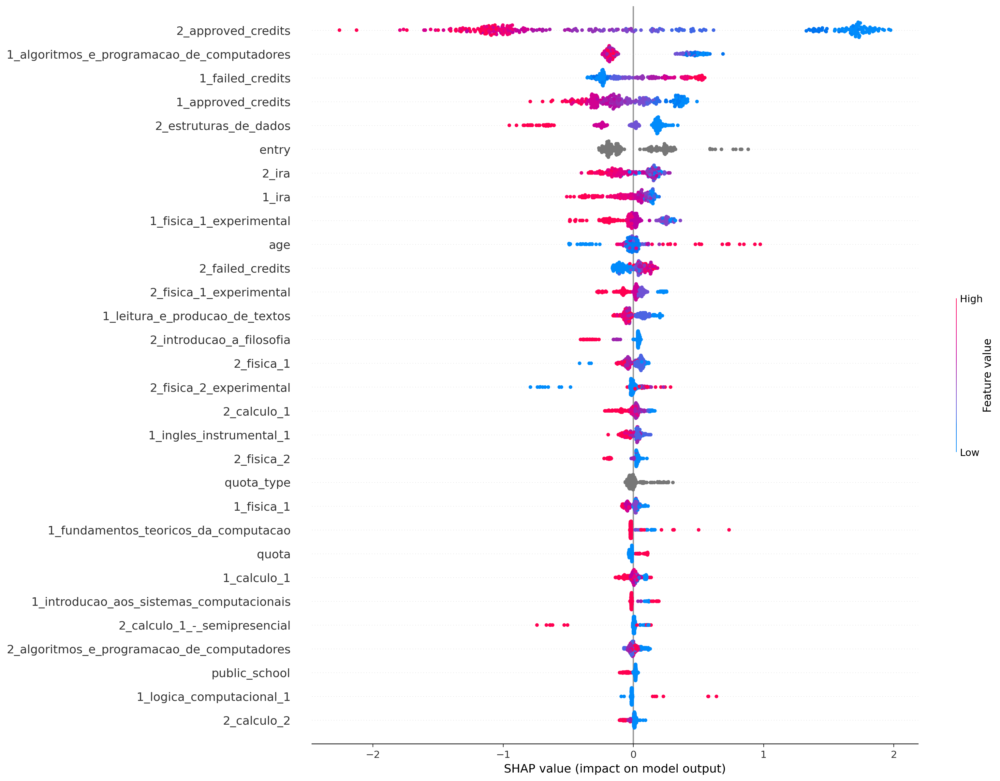
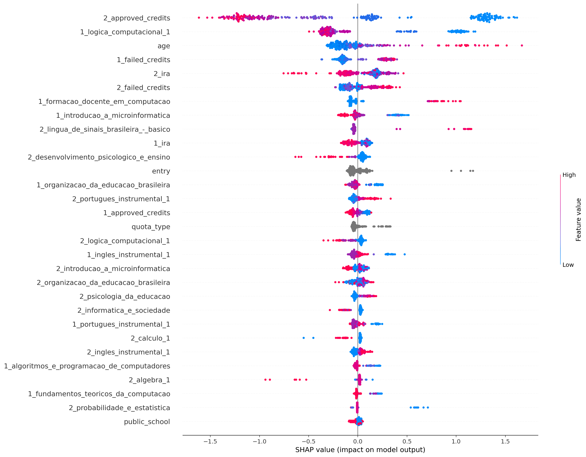
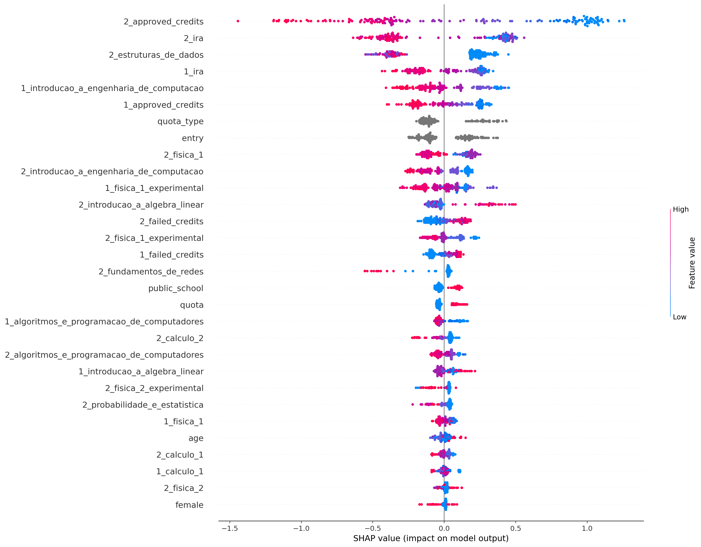
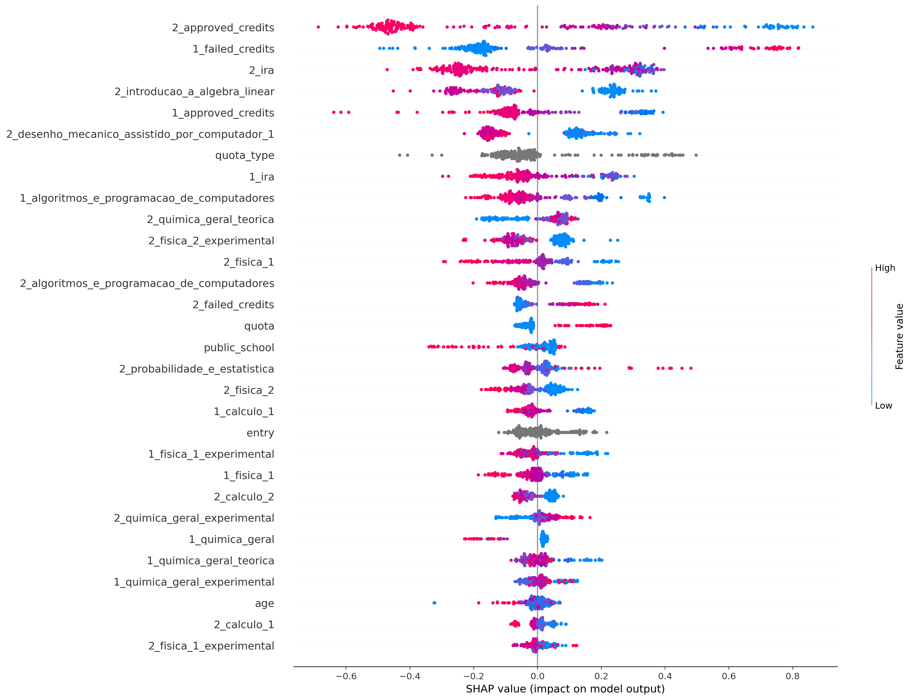
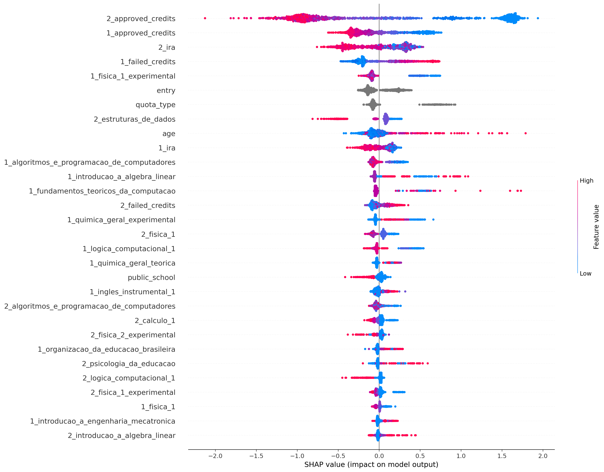

## ciência_da_computação
Treino:
*   Accuracy = 91.32%
*   Precision = 90.91%
*   Recall = 95.86%
*   FScore = 93.77%

Teste:
*   Accuracy = 79.17%
*   Precision = 81.73%
*   Recall = 86.29%
*   FScore = 84.36%

## computação
Treino:
*   Accuracy = 91.79%
*   Precision = 91.77%
*   Recall = 97.99%
*   FScore = 95.34%

Teste:
*   Accuracy = 82.52%
*   Precision = 84.15%
*   Recall = 94.89%
*   FScore = 90.18%

## engenharia_de_computação
Treino:
*   Accuracy = 92.33%
*   Precision = 93.21%
*   Recall = 95.26%
*   FScore = 94.41%

Teste:
*   Accuracy = 75.98%
*   Precision = 80.99%
*   Recall = 83.05%
*   FScore = 82.19%

## engenharia_mecatrônica
Treino:
*   Accuracy = 86.95%
*   Precision = 82.09%
*   Recall = 97.07%
*   FScore = 90.32%

Teste:
*   Accuracy = 77.05%
*   Precision = 73.17%
*   Recall = 90.91%
*   FScore = 82.69%

## all
Treino:
*   Accuracy = 86.75%
*   Precision = 87.10%
*   Recall = 93.58%
*   FScore = 90.81%

Teste:
*   Accuracy = 79.56%
*   Precision = 81.09%
*   Recall = 89.56%
*   FScore = 85.88%

