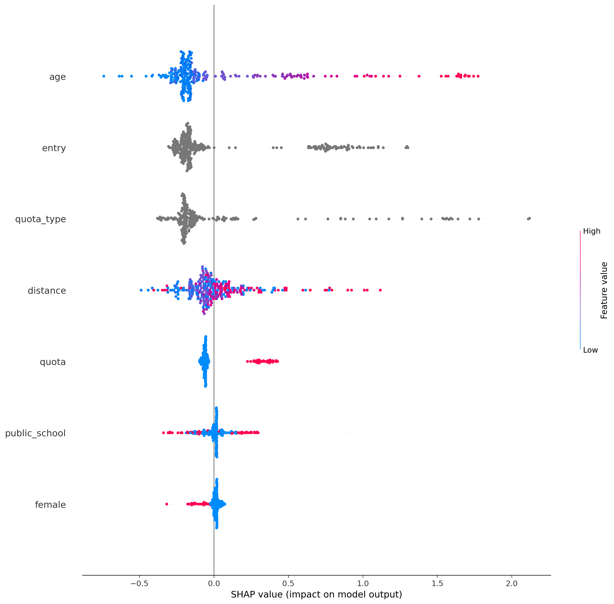
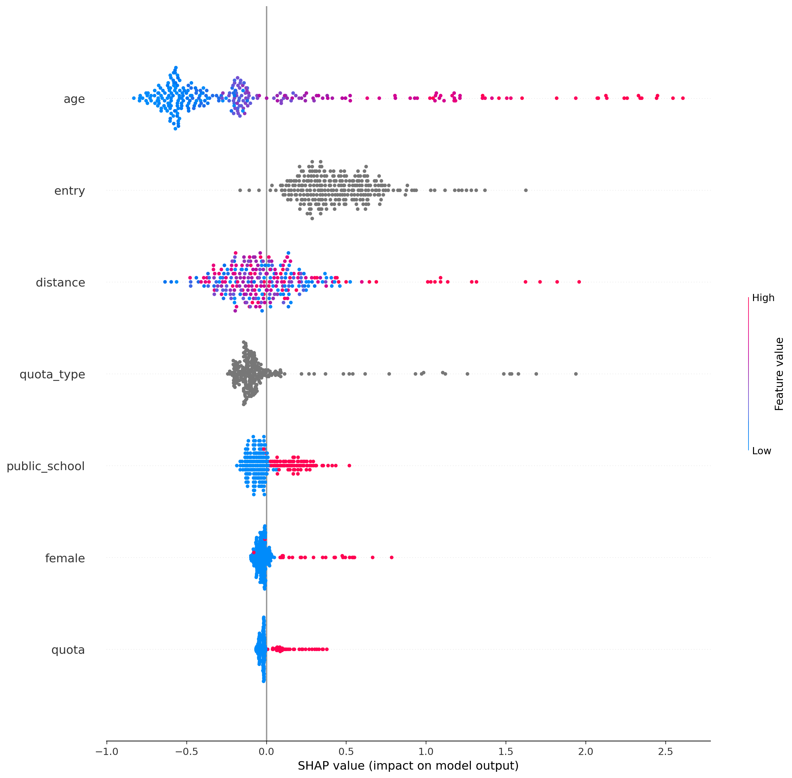
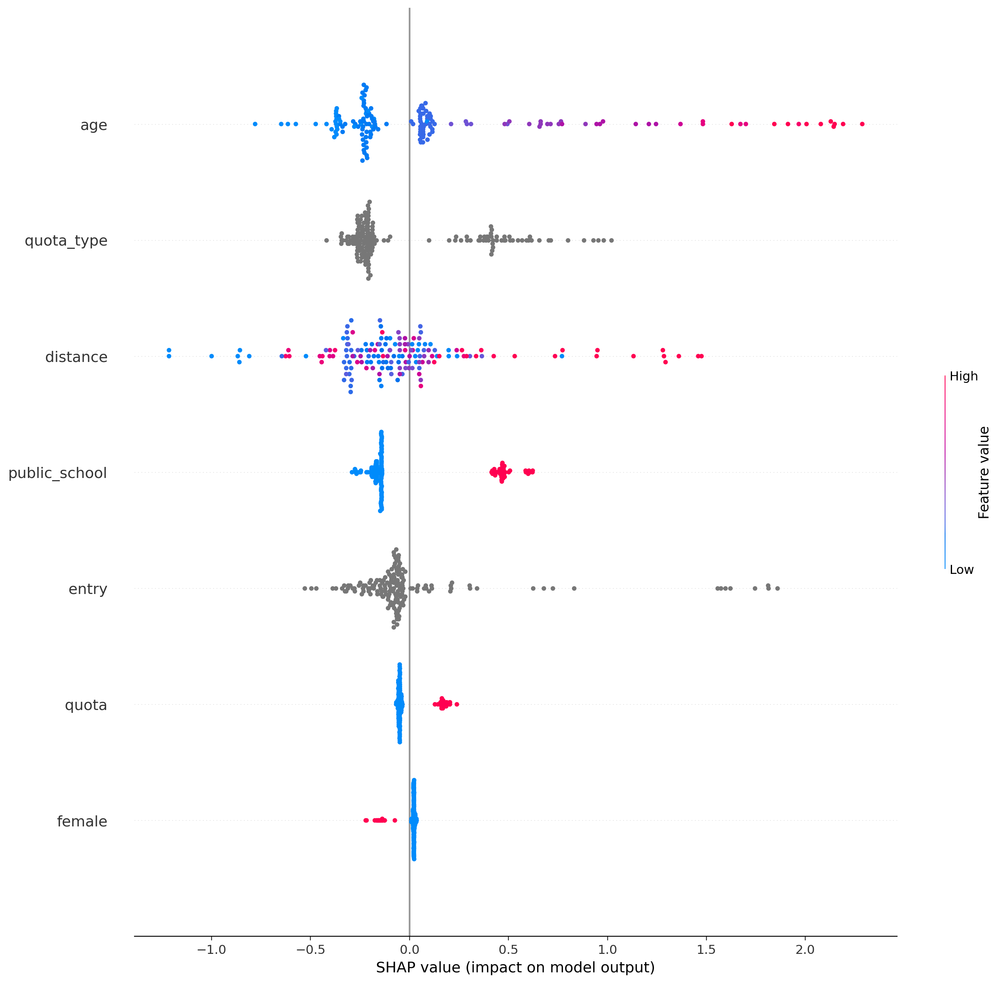
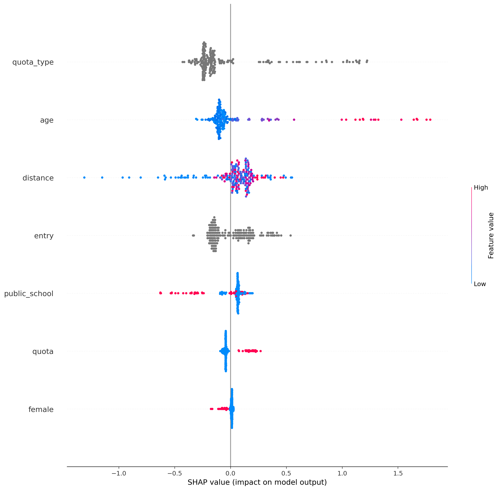
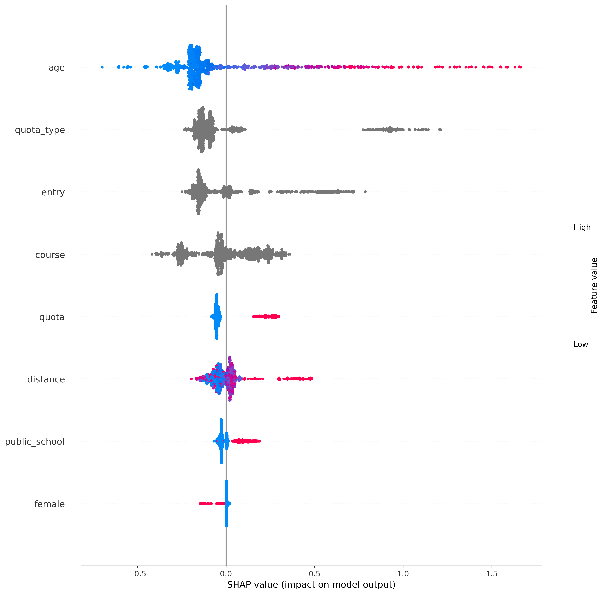

## ciência_da_computação
Treino:
*   Accuracy = 69.27%
*   Precision = 67.85%
*   Recall = 98.59%
*   FScore = 83.15%

Teste:
*   Accuracy = 62.02%
*   Precision = 63.50%
*   Recall = 95.08%
*   FScore = 78.98%

Parametros:
*   depth = 4
*   l2_leaf_reg = 1
*   learning_rate = 0.01

## computação
Treino:
*   Accuracy = 80.56%
*   Precision = 80.71%
*   Recall = 97.55%
*   FScore = 89.86%

Teste:
*   Accuracy = 72.40%
*   Precision = 75.77%
*   Recall = 93.36%
*   FScore = 85.25%

Parametros:
*   depth = 4
*   l2_leaf_reg = 1
*   learning_rate = 0.01

## engenharia_de_computação
Treino:
*   Accuracy = 77.19%
*   Precision = 76.61%
*   Recall = 93.00%
*   FScore = 85.51%

Teste:
*   Accuracy = 59.88%
*   Precision = 64.89%
*   Recall = 81.73%
*   FScore = 73.87%

Parametros:
*   depth = 4
*   l2_leaf_reg = 1
*   learning_rate = 0.01

## engenharia_mecatrônica
Treino:
*   Accuracy = 68.02%
*   Precision = 64.04%
*   Recall = 88.72%
*   FScore = 76.62%

Teste:
*   Accuracy = 58.77%
*   Precision = 57.42%
*   Recall = 80.91%
*   FScore = 69.29%

Parametros:
*   depth = 4
*   l2_leaf_reg = 1
*   learning_rate = 0.01

## all
Treino:
*   Accuracy = 67.96%
*   Precision = 67.41%
*   Recall = 97.88%
*   FScore = 82.58%

Teste:
*   Accuracy = 65.10%
*   Precision = 66.06%
*   Recall = 94.89%
*   FScore = 80.49%

Parametros:
*   depth = 6
*   l2_leaf_reg = 3
*   learning_rate = 0.01

