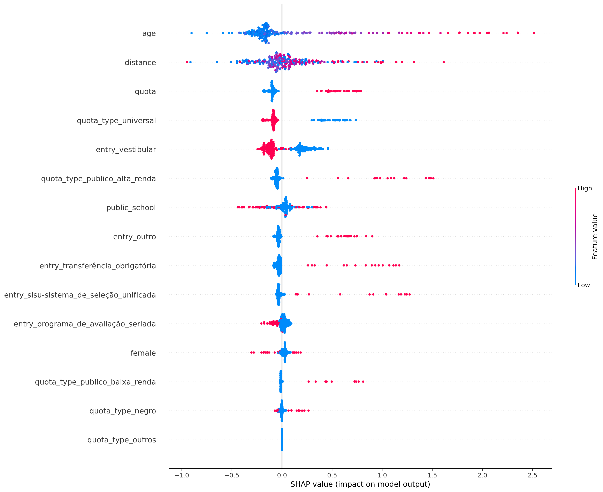
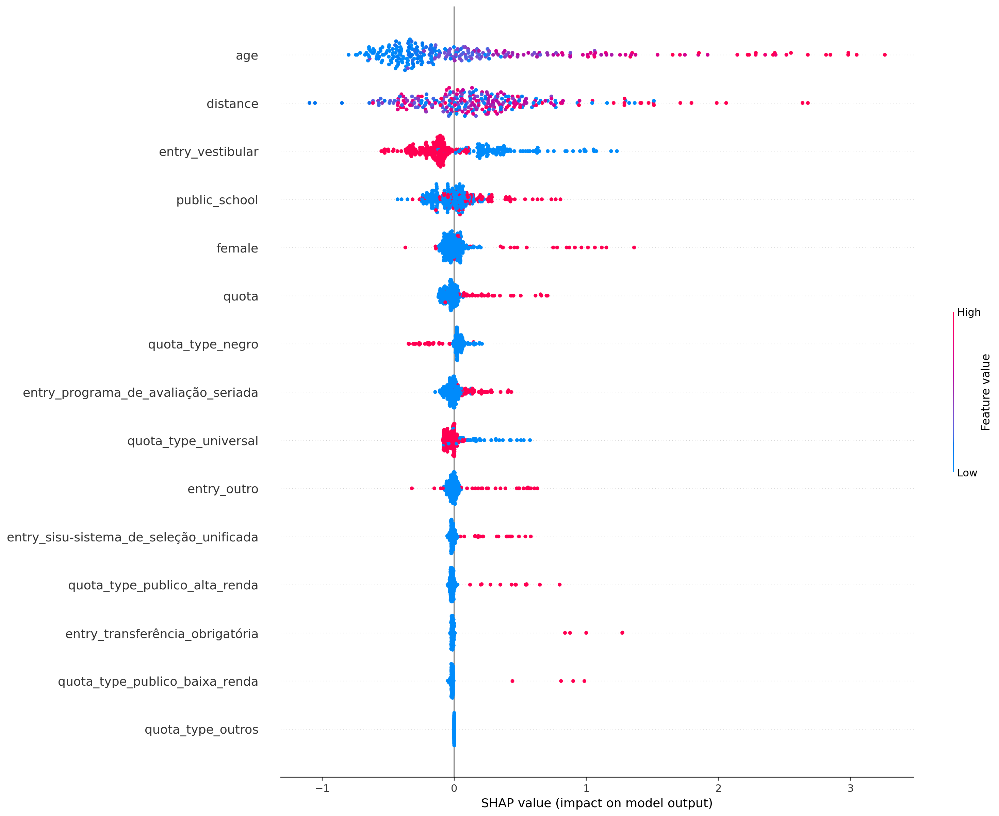
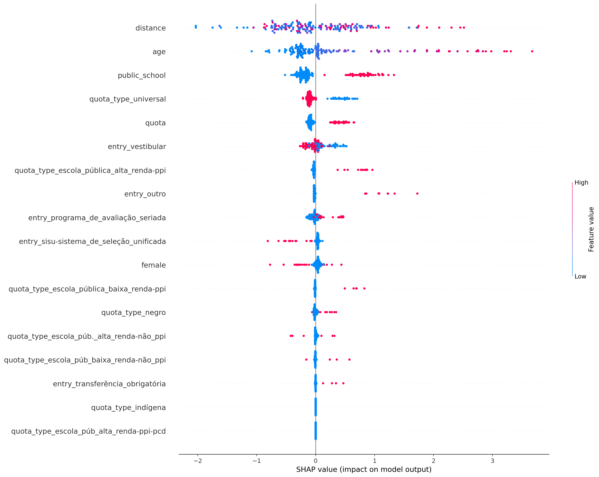
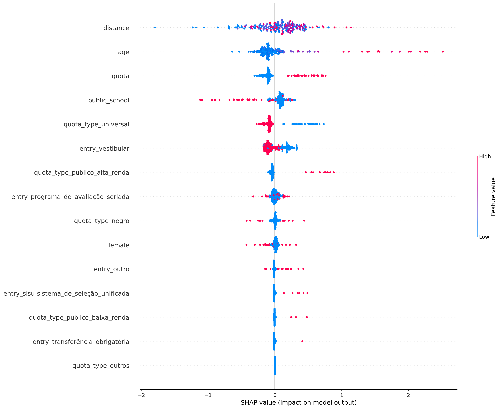
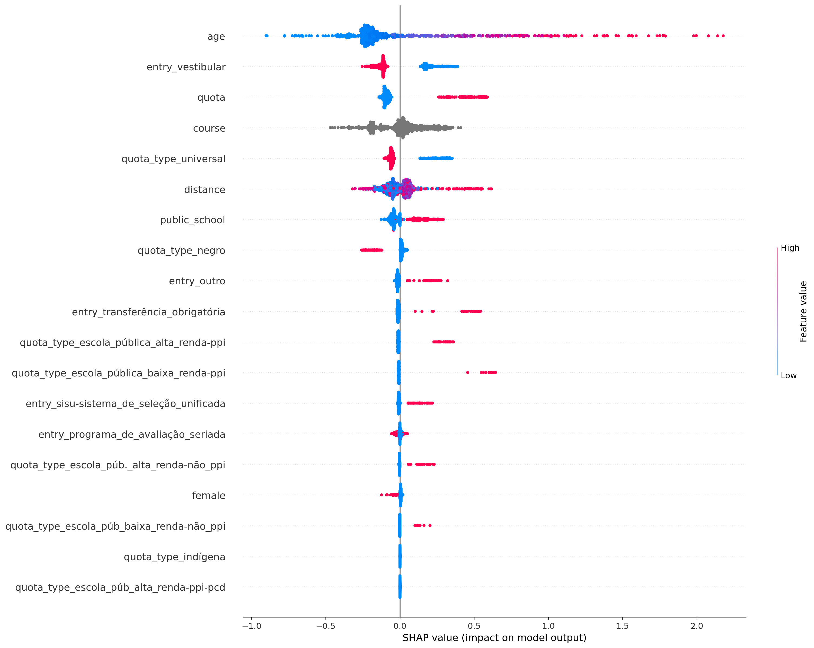

## ciência_da_computação
Treino:
*   Accuracy = 75.86%
*   Precision = 74.22%
*   Recall = 95.31%
*   FScore = 85.37%

Teste:
*   Accuracy = 61.32%
*   Precision = 64.75%
*   Recall = 86.34%
*   FScore = 75.96%

Parametros:
*   depth = 4
*   l2_leaf_reg = 1
*   learning_rate = 0.01

## computação
Treino:
*   Accuracy = 90.74%
*   Precision = 89.94%
*   Recall = 98.77%
*   FScore = 94.95%

Teste:
*   Accuracy = 71.33%
*   Precision = 76.10%
*   Recall = 90.52%
*   FScore = 84.00%

Parametros:
*   depth = 6
*   l2_leaf_reg = 1
*   learning_rate = 0.01

## engenharia_de_computação
Treino:
*   Accuracy = 82.23%
*   Precision = 80.77%
*   Recall = 95.06%
*   FScore = 88.63%

Teste:
*   Accuracy = 62.96%
*   Precision = 67.46%
*   Recall = 81.73%
*   FScore = 75.21%

Parametros:
*   depth = 4
*   l2_leaf_reg = 1
*   learning_rate = 0.01

## engenharia_mecatrônica
Treino:
*   Accuracy = 78.21%
*   Precision = 73.73%
*   Recall = 90.66%
*   FScore = 82.86%

Teste:
*   Accuracy = 62.09%
*   Precision = 60.42%
*   Recall = 79.09%
*   FScore = 70.20%

Parametros:
*   depth = 6
*   l2_leaf_reg = 5
*   learning_rate = 0.01

## all
Treino:
*   Accuracy = 66.96%
*   Precision = 66.45%
*   Recall = 99.01%
*   FScore = 82.45%

Teste:
*   Accuracy = 64.89%
*   Precision = 65.41%
*   Recall = 97.20%
*   FScore = 81.05%

Parametros:
*   depth = 4
*   l2_leaf_reg = 7
*   learning_rate = 0.01

