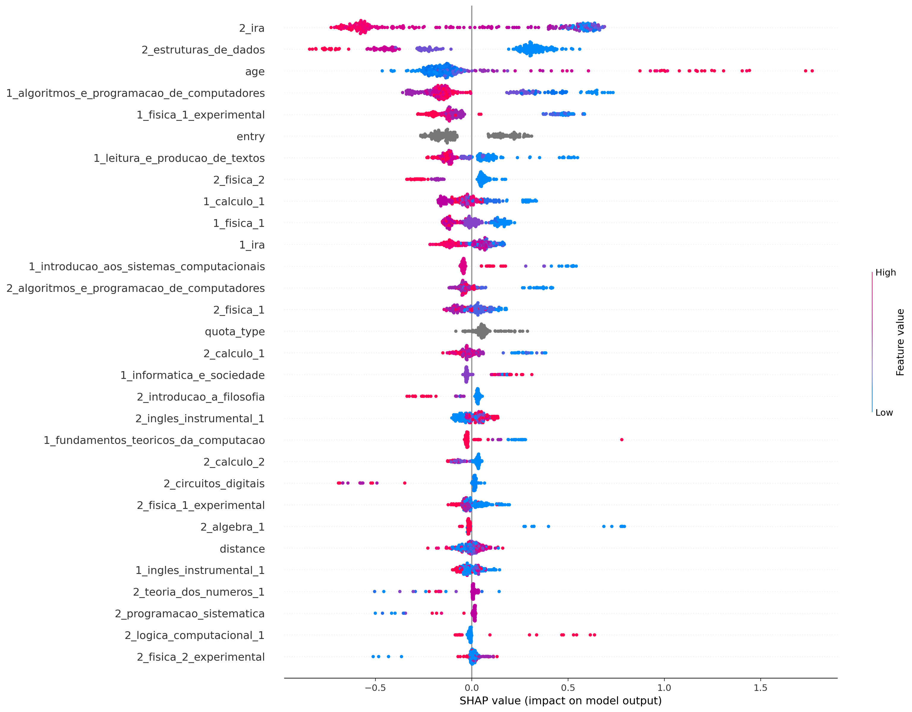
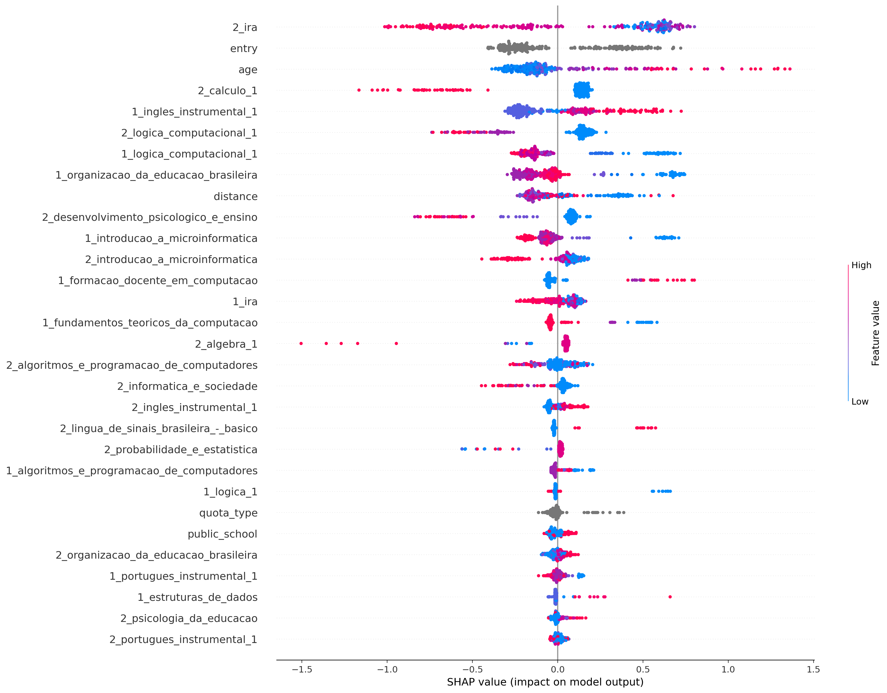
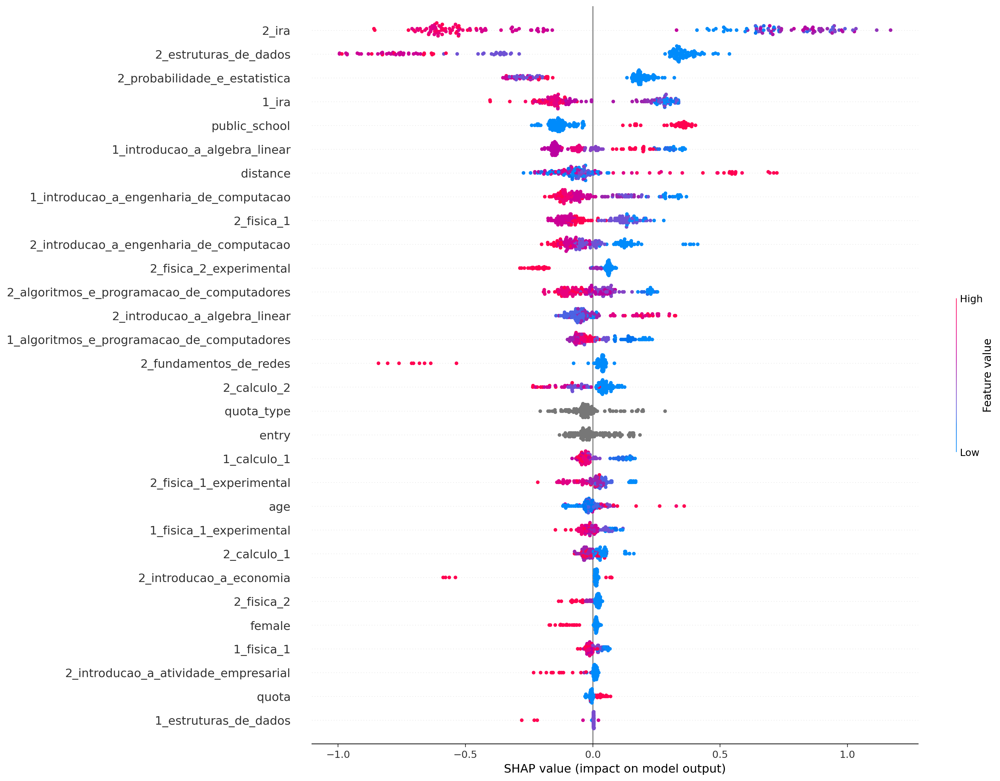
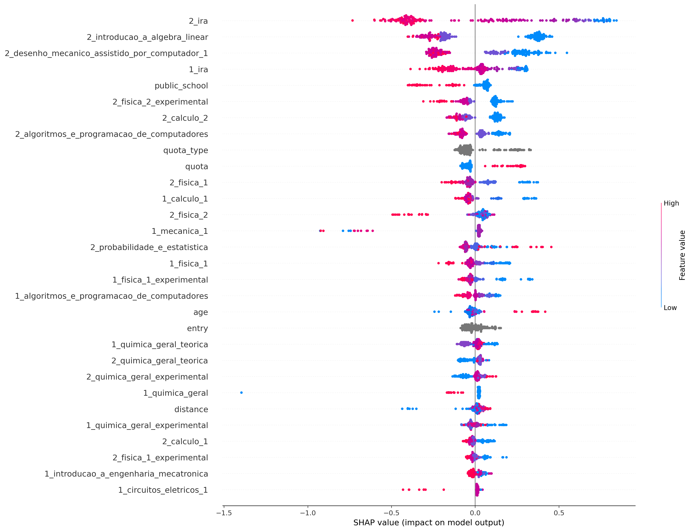
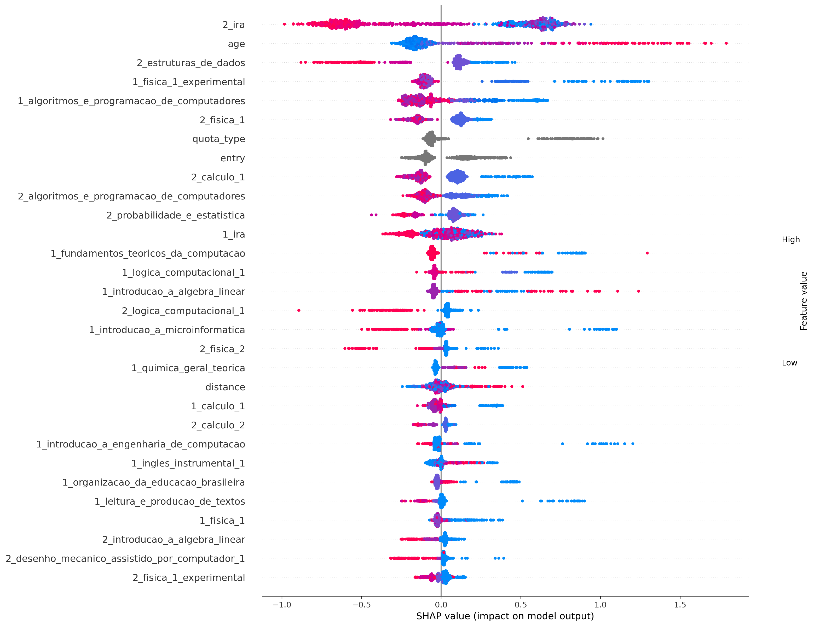

## ciência_da_computação
Treino:
*   Accuracy = 90.88%
*   Precision = 91.80%
*   Recall = 94.16%
*   FScore = 93.18%

Teste:
*   Accuracy = 79.09%
*   Precision = 82.20%
*   Recall = 85.79%
*   FScore = 84.28%

## computação
Treino:
*   Accuracy = 94.62%
*   Precision = 95.43%
*   Recall = 97.56%
*   FScore = 96.68%

Teste:
*   Accuracy = 78.85%
*   Precision = 82.76%
*   Recall = 91.00%
*   FScore = 87.43%

## engenharia_de_computação
Treino:
*   Accuracy = 91.27%
*   Precision = 90.73%
*   Recall = 96.31%
*   FScore = 93.94%

Teste:
*   Accuracy = 74.85%
*   Precision = 77.12%
*   Recall = 86.67%
*   FScore = 82.48%

## engenharia_mecatrônica
Treino:
*   Accuracy = 86.15%
*   Precision = 82.47%
*   Recall = 93.39%
*   FScore = 88.58%

Teste:
*   Accuracy = 80.57%
*   Precision = 74.82%
*   Recall = 94.55%
*   FScore = 85.33%

## all
Treino:
*   Accuracy = 86.07%
*   Precision = 86.71%
*   Recall = 92.75%
*   FScore = 90.18%

Teste:
*   Accuracy = 77.96%
*   Precision = 80.55%
*   Recall = 87.03%
*   FScore = 84.25%

