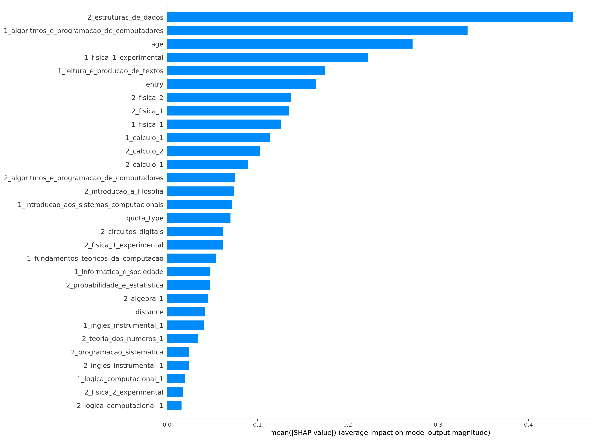
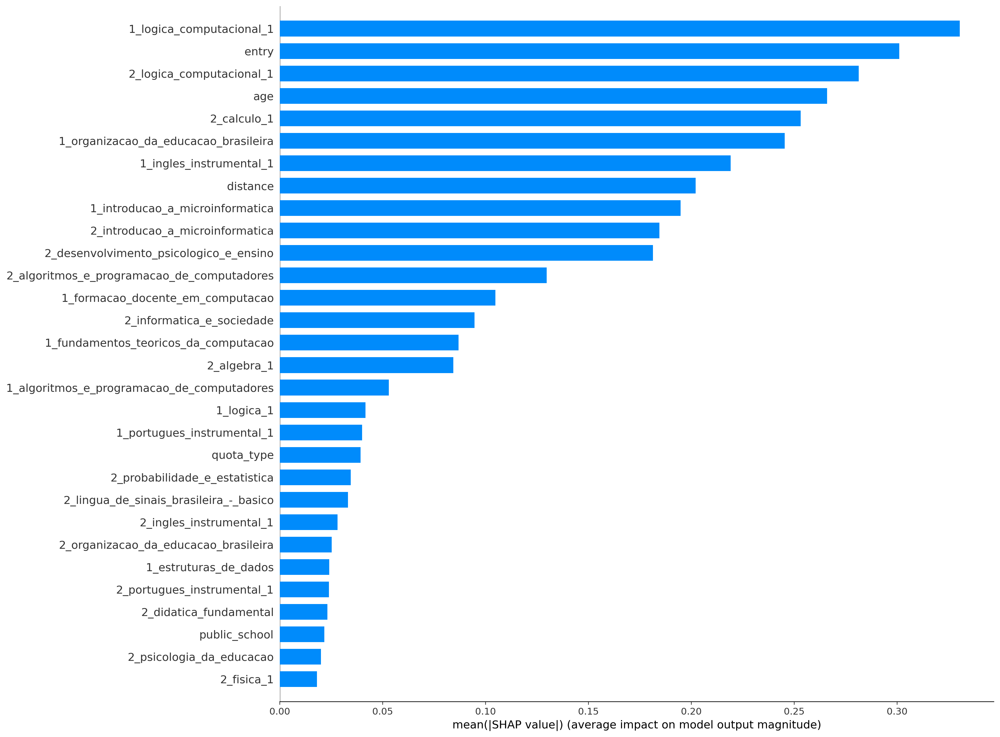
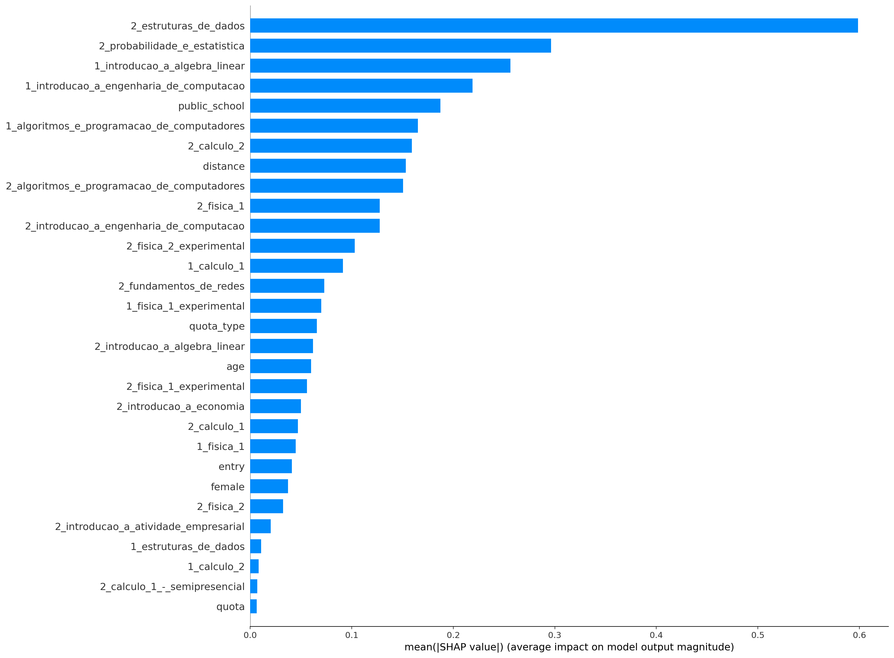
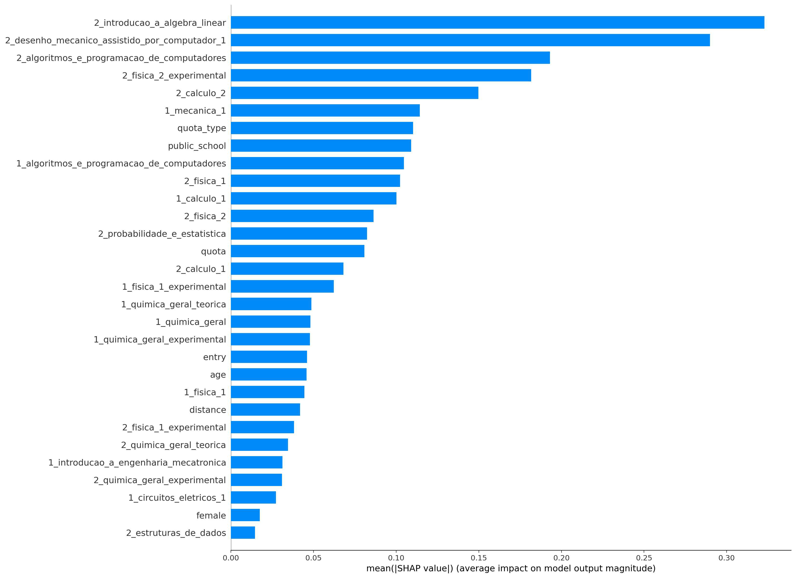
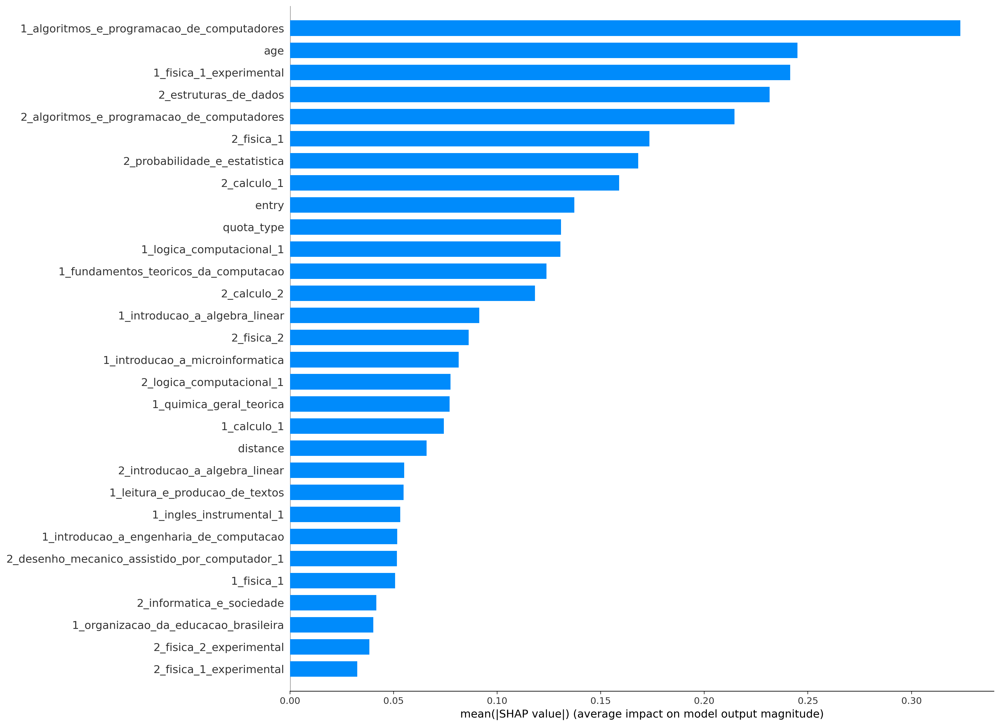

## ciência_da_computação
Treino:
*   Accuracy = 89.54%
*   Precision = 90.13%
*   Recall = 93.93%
*   FScore = 92.33%

Teste:
*   Accuracy = 77.70%
*   Precision = 80.51%
*   Recall = 85.79%
*   FScore = 83.55%

## computação
Treino:
*   Accuracy = 94.32%
*   Precision = 94.70%
*   Recall = 97.97%
*   FScore = 96.60%

Teste:
*   Accuracy = 78.14%
*   Precision = 82.61%
*   Recall = 90.05%
*   FScore = 86.84%

## engenharia_de_computação
Treino:
*   Accuracy = 91.27%
*   Precision = 92.71%
*   Recall = 93.85%
*   FScore = 93.38%

Teste:
*   Accuracy = 78.53%
*   Precision = 81.25%
*   Recall = 86.67%
*   FScore = 84.36%

## engenharia_mecatrônica
Treino:
*   Accuracy = 85.13%
*   Precision = 82.17%
*   Recall = 91.44%
*   FScore = 87.40%

Teste:
*   Accuracy = 80.09%
*   Precision = 75.37%
*   Recall = 91.82%
*   FScore = 84.28%

## all
Treino:
*   Accuracy = 85.66%
*   Precision = 87.73%
*   Recall = 90.57%
*   FScore = 89.38%

Teste:
*   Accuracy = 77.85%
*   Precision = 81.18%
*   Recall = 85.71%
*   FScore = 83.80%

