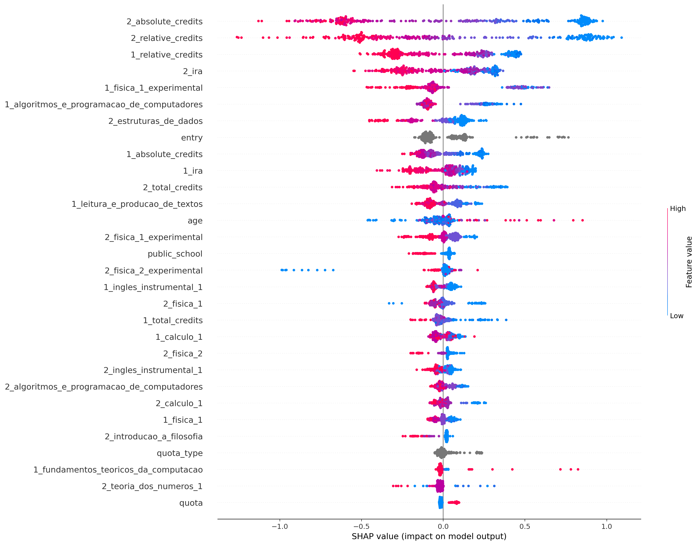
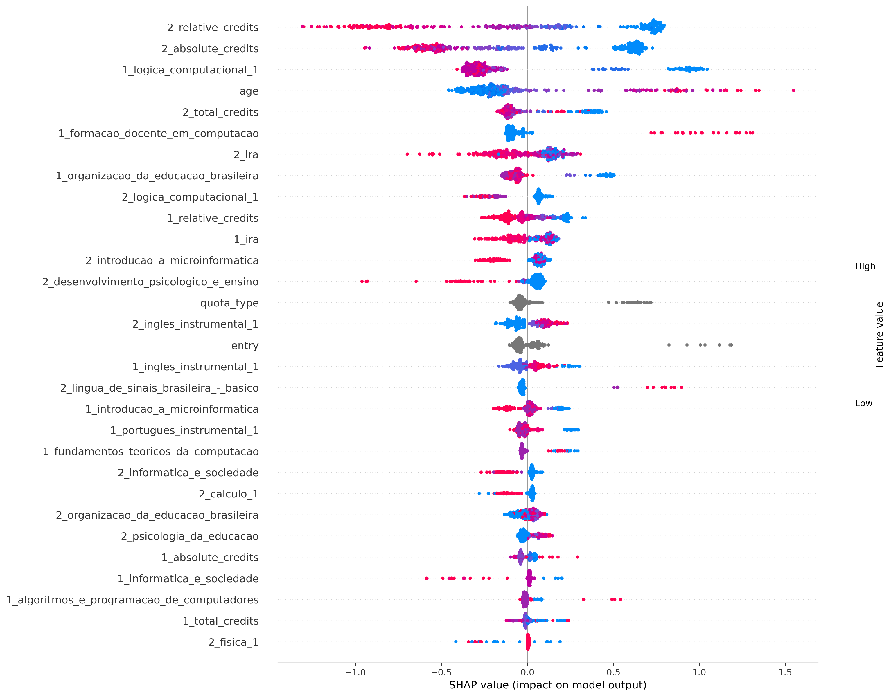
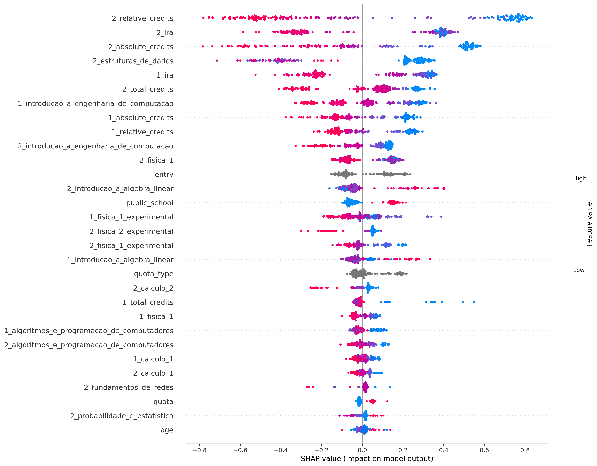
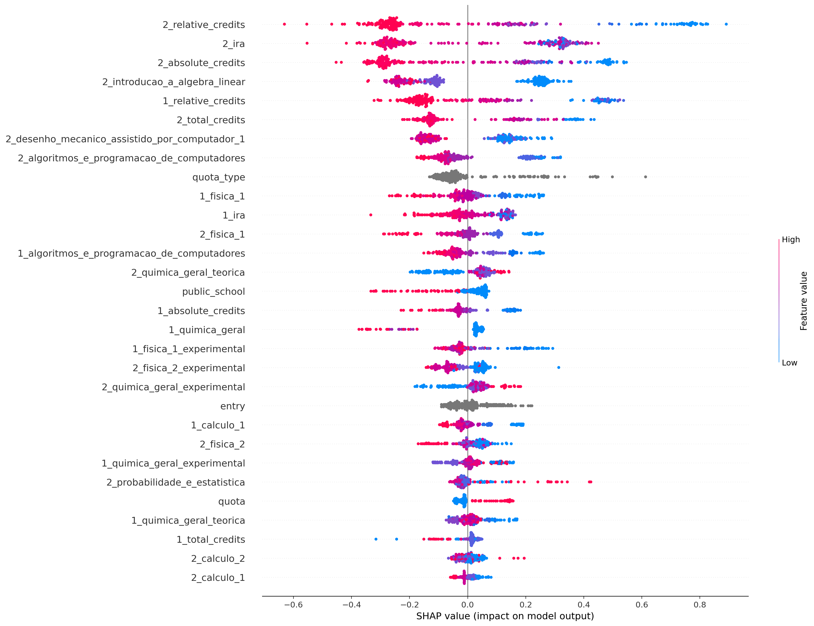
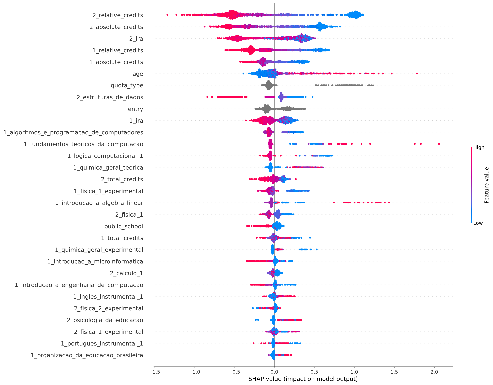

## ciência_da_computação
Treino:
*   Accuracy = 92.76%
*   Precision = 94.11%
*   Recall = 94.50%
*   FScore = 94.34%

Teste:
*   Accuracy = 81.31%
*   Precision = 84.21%
*   Recall = 86.70%
*   FScore = 85.66%

## computação
Treino:
*   Accuracy = 94.21%
*   Precision = 97.27%
*   Recall = 95.03%
*   FScore = 95.93%

Teste:
*   Accuracy = 79.00%
*   Precision = 87.55%
*   Recall = 84.30%
*   FScore = 85.60%

## engenharia_de_computação
Treino:
*   Accuracy = 90.89%
*   Precision = 88.56%
*   Recall = 98.91%
*   FScore = 94.39%

Teste:
*   Accuracy = 75.56%
*   Precision = 76.81%
*   Recall = 89.83%
*   FScore = 84.00%

## engenharia_mecatrônica
Treino:
*   Accuracy = 87.14%
*   Precision = 82.16%
*   Recall = 97.12%
*   FScore = 90.38%

Teste:
*   Accuracy = 75.70%
*   Precision = 71.51%
*   Recall = 91.11%
*   FScore = 81.91%

## all
Treino:
*   Accuracy = 87.00%
*   Precision = 86.69%
*   Recall = 94.58%
*   FScore = 91.18%

Teste:
*   Accuracy = 78.84%
*   Precision = 80.76%
*   Recall = 88.65%
*   FScore = 85.24%

